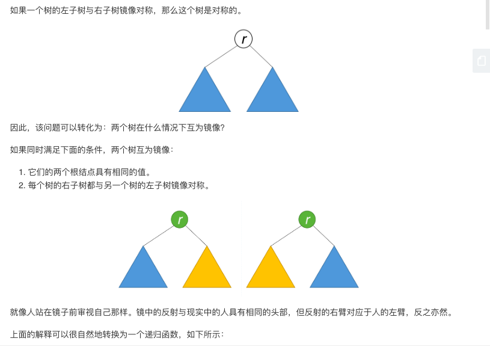

## 题目
给定一个二叉树，检查它是否是镜像对称的。


**示例1**
例如，二叉树 [1,2,2,3,4,4,3] 是对称的。
```
    1
   / \
  2   2
 / \ / \
3  4 4  3
```
但是下面这个 [1,2,2,null,3,null,3] 则不是镜像对称的:
```
    1
   / \
  2   2
   \   \
   3    3
```


## 代码(递归)
```Java
/**
 * Definition for a binary tree node.
 * public class TreeNode {
 *     int val;
 *     TreeNode left;
 *     TreeNode right;
 *     TreeNode() {}
 *     TreeNode(int val) { this.val = val; }
 *     TreeNode(int val, TreeNode left, TreeNode right) {
 *         this.val = val;
 *         this.left = left;
 *         this.right = right;
 *     }
 * }
 */
class Solution {
    public boolean isSymmetric(TreeNode root) {
        if(root == null) return true;
        return isSymmetric(root.left, root.right);
    }

    public boolean isSymmetric(TreeNode left, TreeNode right) {
        if(left == null && right == null) return true;
        if(left == null || right == null) return false;
        return left.val == right.val && isSymmetric(left.left, right.right) && isSymmetric(left.right, right.left);
    }

}
```

## 代码(迭代)
```Java
/**
 * Definition for a binary tree node.
 * public class TreeNode {
 *     int val;
 *     TreeNode left;
 *     TreeNode right;
 *     TreeNode() {}
 *     TreeNode(int val) { this.val = val; }
 *     TreeNode(int val, TreeNode left, TreeNode right) {
 *         this.val = val;
 *         this.left = left;
 *         this.right = right;
 *     }
 * }
 */
class Solution {
    public boolean isSymmetric(TreeNode root) {
        if(root == null) return true;
        Queue<TreeNode> queue = new LinkedList<>();
        queue.offer(root.left);
        queue.offer(root.right);
        while(!queue.isEmpty()){
            TreeNode left = queue.poll();
            TreeNode right = queue.poll();
            if(left == null && right == null) continue;
            if(left == null || right == null) return false;
            if(left.val != right.val) return false;
            queue.offer(left.left);
            queue.offer(right.right);
            queue.offer(left.right);
            queue.offer(right.left);
        }
        return true;
    }

}
```


## 思路

### 解法1
这题可以通过递归的方式判断。


### 解法2
除了递归的方法外，我们也可以利用队列进行迭代。队列中每两个连续的结点应该是相等的，而且它们的子树互为镜像。最初，队列中包含的是 root 以及 root。该算法的工作原理类似于 BFS，但存在一些关键差异。每次提取两个结点并比较它们的值。然后，将两个结点的左右子结点按相反的顺序插入队列中。当队列为空时，或者我们检测到树不对称（即从队列中取出两个不相等的连续结点）时，该算法结束。
