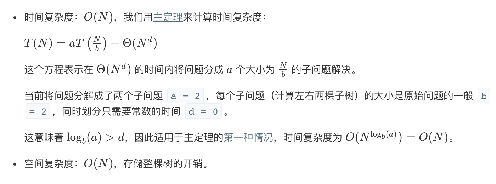

## 题目
根据一棵树的前序遍历与中序遍历构造二叉树。

**示例1**
你可以假设树中没有重复的元素。

例如，给出
```
前序遍历 preorder = [3,9,20,15,7]
中序遍历 inorder = [9,3,15,20,7]
```
返回如下的二叉树：
```
    3
   / \
  9  20
    /  \
   15   7
```

## 代码（递归）
```C++
/**
 * Definition for a binary tree node.
 * struct TreeNode {
 *     int val;
 *     TreeNode *left;
 *     TreeNode *right;
 *     TreeNode(int x) : val(x), left(NULL), right(NULL) {}
 * };
 */
class Solution {
public:
    int index;
    vector<int> inorder;
    vector<int> preorder;
    unordered_map<int,int> hash;
    TreeNode* buildTree(vector<int>& preorder, vector<int>& inorder) {
        this->inorder = inorder;
        this->preorder = preorder;
        this->index = 0;
        int length = inorder.size();
        for(int i = 0;i < length;i++){
            hash[inorder[i]] = i;
        }
        return helper(0, length - 1);
    }
    
    TreeNode* helper(int left, int right){
        if(right < left){
            return NULL;
        }
        
        int val = preorder[this->index++];
    
        TreeNode* node = new TreeNode(val);
        
        int index = hash[val];
      
        node->left = helper(left, index - 1);
        node->right = helper(index + 1, right);
        
        return node;
    }
};
```

## 代码（迭代）
```C++
/**
 * Definition for a binary tree node.
 * struct TreeNode {
 *     int val;
 *     TreeNode *left;
 *     TreeNode *right;
 *     TreeNode(int x) : val(x), left(NULL), right(NULL) {}
 * };
 */
class Solution {
public:
    TreeNode* buildTree(vector<int>& preorder, vector<int>& inorder) {
        
        int length = inorder.size();
        if(length == 0){
            return NULL;
        }
        // 获取最根节点值 并构建该节点
        int rootVal = preorder[0];
        TreeNode* root = new TreeNode(rootVal);
        
        // 根节点入栈，迭代构建左右子树
        stack<TreeNode*> travelStack;
        travelStack.push(root);
        // 迭代终止条件是preIndex == preorder.size()，证明所有节点遍历完成
        for (int preIndex = 1, inIndex = 0; preIndex < preorder.size(); ++preIndex) {
            TreeNode* tmp = NULL;
            while (!travelStack.empty() && travelStack.top()->val == inorder[inIndex]) {
                // 循环条件：栈不为空，且栈顶刚好是中序的第i个节点
                // 中序定义：一颗完整的树（左右孩子均有）第一个节点是左节点 然后是根节点，最后是右节点
                // 为什么是while不是if：while可以保证连续地弹出栈顶节点
                // 如果栈顶的元素是中序的第i个元素，那么证明已经构建到当前的位置了
                // 换句话说就是左子树已经全部构建完毕了，那么接下来的节点一定是右子树
                // 否则的话不会进入循环，tmp是空值，那么证明这个节点的左子树还没有构建完成
                ++inIndex;
                tmp = travelStack.top();
                travelStack.pop();
            }
            
            // 获取先序的下一个节点值，构建节点
            TreeNode* cur = new TreeNode(preorder[preIndex]);
            
            // 先序节点获取的顺序是根-左-右的，tmp的取值在while循环内已经阐述过了
            if (tmp == NULL) {
                // 如果是空值，那么证明栈顶元素的左子树还没有构建完成，继续构建左子树
                // 换句话说就是刚刚构建的cur节点一定是栈顶的左子叶
                travelStack.top()->left = cur;
            } else {
                // 否则栈顶的左子树已经完成了，而刚刚构建的cur是栈顶的右子叶
                tmp->right = cur;
            }
            // 将这个子叶压栈，循环检查
            travelStack.push(cur);
        }
        return root;
    }
};
```

## 思路

### 解法1

* 创建哈希表存储中序序列：value -> its index。
* 方法 helper 的参数是中序序列中当前子树的左右边界，该方法仅用于检查子树是否为空。下面分析 helper(left = 0, right = n - 1) 的逻辑：
* 如果 in_right < in_left，说明子树为空，返回 None。
* 选择先序遍历的第一个节点作为根节点。
* 假设根节点在中序遍历中索引为 index。从 left 到 index - 1 属于左子树，从 index + 1 到 right 属于右子树。
* 根据先序遍历逻辑，递归创建左子树 helper(left, index - 1) 和右子树helper(index + 1, right)。(注意一定得先左子树再右子树。)
* 返回根节点 root。



### 解法2

迭代法感觉要复杂些，可看注释，抄的别人的，感觉没咋看懂。