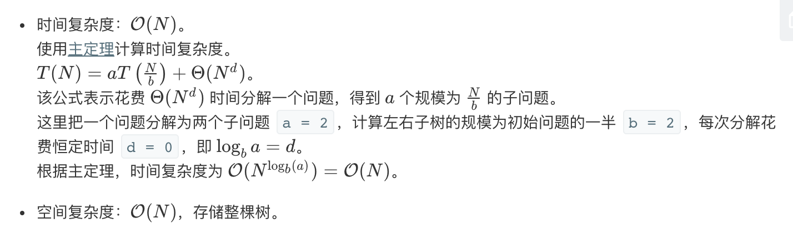

## 题目
根据一棵树的中序遍历与后序遍历构造二叉树。

**示例1**
你可以假设树中没有重复的元素。

例如，给出
```
中序遍历 inorder = [9,3,15,20,7]
后序遍历 postorder = [9,15,7,20,3]
```
返回如下的二叉树：
```
    3
   / \
  9  20
    /  \
   15   7
```

## 代码（递归）
```C++
/**
 * Definition for a binary tree node.
 * struct TreeNode {
 *     int val;
 *     TreeNode *left;
 *     TreeNode *right;
 *     TreeNode(int x) : val(x), left(NULL), right(NULL) {}
 * };
 */
class Solution {
public:
    vector<int> inorder;
    vector<int> postorder;
    unordered_map<int,int> hash;
    TreeNode* buildTree(vector<int>& inorder, vector<int>& postorder) {
        this->inorder = inorder;
        this->postorder = postorder;
        int length = inorder.size();
        for(int i = 0;i < length;i++){
            hash[inorder[i]] = i;
        }
        return helper(0, length - 1);
    }
    
    TreeNode* helper(int left, int right){
        if(right < left){
            return NULL;
        }
        
        int val = postorder.back();
        postorder.pop_back();
        
        TreeNode* node = new TreeNode(val);
        
        int index = hash[val];
        
        node->right = helper(index + 1, right);
        node->left = helper(left, index - 1);
        
        return node;
    }
};
```

## 代码（迭代）
```C++
/**
 * Definition for a binary tree node.
 * struct TreeNode {
 *     int val;
 *     TreeNode *left;
 *     TreeNode *right;
 *     TreeNode(int x) : val(x), left(NULL), right(NULL) {}
 * };
 */
class Solution {
public:
    vector<int> inorder;
    vector<int> postorder;
    unordered_map<int,int> hash;
    TreeNode* buildTree(vector<int>& inorder, vector<int>& postorder) {
        this->inorder = inorder;
        this->postorder = postorder;
        int length = inorder.size();
        if(length == 0){
            return NULL;
        }
        // 弹出最根节点值 并构建该节点
        int rootVal = postorder.back();
        postorder.pop_back();
        TreeNode* root = new TreeNode(rootVal);
        
        // 根节点入栈，迭代构建左右子树
        stack<TreeNode*> travelStack;
        travelStack.push(root);
        // 迭代终止条件是后序遍历节点全部弹出，证明遍历完成
        while (postorder.size()) {
            TreeNode* tmp = NULL;
            while (!travelStack.empty() && travelStack.top()->val == inorder.back()) {
                // 循环条件：栈不为空，且栈顶刚好是中序的最后一个节点
                // 中序定义：一颗完整的树（左右孩子均有）最后一个节点是右节点，然后根节点，然后左节点
                // 为什么是while不是if：while可以保证连续地弹出栈顶节点
                // 如果栈顶的元素是中序的最后一个元素，那么证明已经构建到当前的位置了
                // 换句话说就是右子树已经全部构建完毕了，那么接下来的节点一定是左子树
                // 否则的话不会进入循环，tmp是空值，那么证明这个节点的右子树还没有构建完成
                inorder.pop_back();
                tmp = travelStack.top();
                travelStack.pop();
            }
            
            // 弹出后序的最后一个节点值，构建节点
            TreeNode* cur = new TreeNode(postorder.back());
            postorder.pop_back();
            
            // 后序节点弹出的值顺序是根-右-左的，tmp的取值在while循环内已经阐述过了
            if (tmp == NULL) {
                // 如果是空值，那么证明栈顶元素的右子树还没有构建完成，继续构建右子树
                // 换句话说就是刚刚构建的cur节点一定是栈顶的右子叶
                travelStack.top()->right = cur;
            } else {
                // 否则栈顶的右子树已经完成了，而刚刚构建的cur是栈顶的左子叶
                tmp->left = cur;
            }
            // 将这个子叶压栈，循环检查
            travelStack.push(cur);
        }
        return root;
    }
};
```

## 思路

### 解法1

* 创建哈希表存储中序序列：value -> its index。
* 方法 helper 的参数是中序序列中当前子树的左右边界，该方法仅用于检查子树是否为空。下面分析 helper(left = 0, right = n - 1) 的逻辑：
* 如果 in_right < in_left，说明子树为空，返回 None。
* 选择后序遍历的最后一个节点作为根节点。
* 假设根节点在中序遍历中索引为 index。从 left 到 index - 1 属于左子树，从 index + 1 到 right 属于右子树。
* 根据后序遍历逻辑，递归创建右子树 helper(index + 1, right) 和左子树 helper(left, index - 1)。(注意一定得先右子树再左子树。)
* 返回根节点 root。



### 解法2

迭代法感觉要复杂些，可看注释，抄的别人的，感觉没咋看懂。