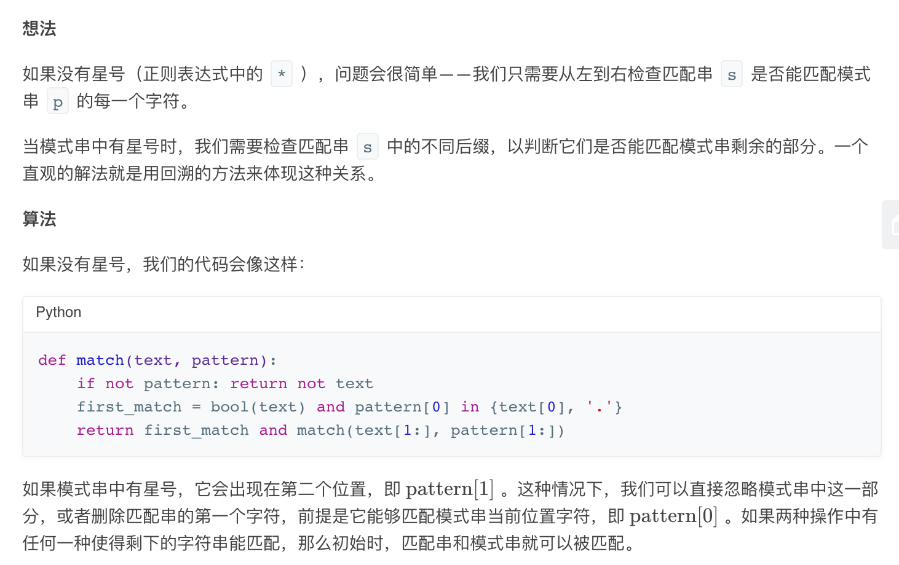
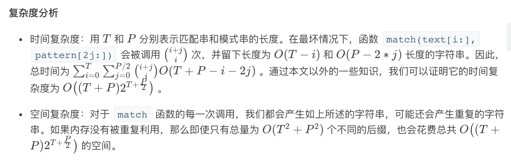
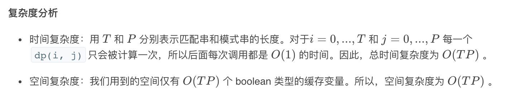

## 题目
给你一个字符串 s 和一个字符规律 p，请你来实现一个支持 '.' 和 '*' 的正则表达式匹配。

```
'.' 匹配任意单个字符
'*' 匹配零个或多个前面的那一个元素
```
所谓匹配，是要涵盖 整个 字符串 s 的，而不是部分字符串。

说明：

* s 可能为空，且只包含从 a-z 的小写字母。
* p 可能为空，且只包含从 a-z 的小写字母，以及字符 . 和 *。

**示例 1**
```
输入：
s = "aa"
p = "a"
输出：false
解释："a" 无法匹配 "aa" 整个字符串。
```

**示例 2**
```
输入：
s = "aa"
p = "a*"
输出：true
解释：因为 '*' 代表可以匹配零个或多个前面的那一个元素，在这里前面的元素就是 'a'。因此，字符串 "aa" 可被视为 'a' 重复了一次。
```

**示例 3**
```
输入：
s = "ab"
p = ".*"
输出：true
解释：".*" 表示可匹配零个或多个（'*'）任意字符（'.'）。
```

**示例 4**
```
输入：
s = "aab"
p = "c*a*b"
输出：true
解释：因为 '*' 表示零个或多个，这里 'c' 为 0 个，'a' 被重复一次。因此可以匹配字符串 "aab"。
```

**示例 5**
```
输入：
s = "mississippi"
p = "mis*is*p*."
输出：false
```

## 代码（回溯）
```JAVA
class Solution {
    public boolean isMatch(String text, String pattern) {
        if(pattern.isEmpty()) return text.isEmpty();
        boolean headMatch = (!text.isEmpty() && (text.charAt(0) == pattern.charAt(0) || pattern.charAt(0) == '.'));
        if(pattern.length() >= 2 && pattern.charAt(1) == '*'){
            return isMatch(text,pattern.substring(2)) || (headMatch && isMatch(text.substring(1),pattern));
        }
        return headMatch && isMatch(text.substring(1),pattern.substring(1));
    }

}
```

## 代码（dp）
```JAVA
class Solution {
    public boolean isMatch(String text, String pattern) {
        int m = text.length();
        int n = pattern.length();
        boolean[][] result = new boolean[m + 1][n + 1];
        result[0][0] = true;
        for(int i = 0;i <= m;i++){
            for(int j = 1;j <= n;j++){
                if(pattern.charAt(j - 1) == '*') {
                    result[i][j] = result[i][j - 2];
                    if(match(text, i, pattern, j - 1)) {
                        result[i][j] = result[i][j] || result[i - 1][j];
                    }
                } else {
                    if(match(text, i, pattern, j)) {
                        result[i][j] = result[i - 1][j - 1];
                    }
                }
            }
        }
        return result[m][n];
    }

    public boolean match(String text, int i, String pattern, int j){
        if(i == 0){
            return false;
        }
        return pattern.charAt(j - 1) == '.' || text.charAt(i - 1) == pattern.charAt(j - 1);
    }
}
```

## 思路

这题没想出来，太菜了。下面答案都是看了解答之后才明白的。

### 解法 1
回溯法比较自然，但是复杂度会高些。因为会涉及许多重复的计算。



### 解法 2
用 dp 能够将结果动态构建 dp 表，避免不必要的计算。在复杂度上会有降低。具体可参考官方 [博客](https://leetcode-cn.com/problems/regular-expression-matching/solution/zheng-ze-biao-da-shi-pi-pei-by-leetcode-solution/)。

