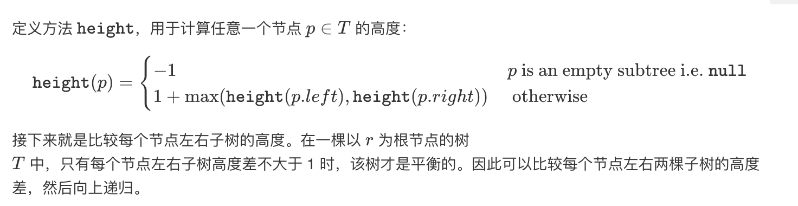
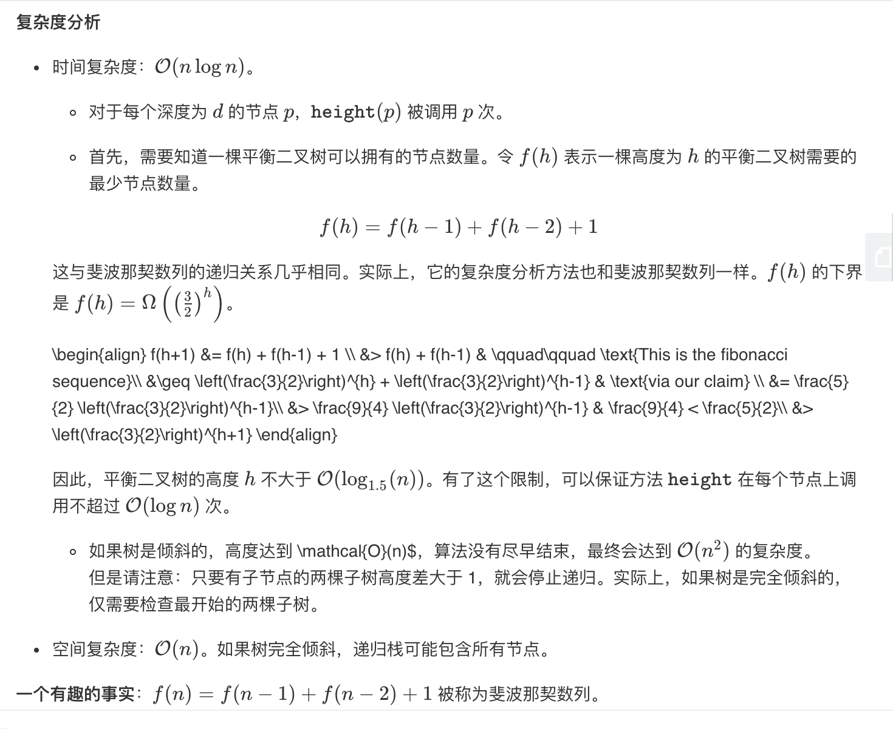

## 题目
给定一个二叉树，判断它是否是高度平衡的二叉树。

本题中，一棵高度平衡二叉树定义为：
> 一个二叉树每个节点 的左右两个子树的高度差的绝对值不超过1

**示例1**
给定二叉树 [3,9,20,null,null,15,7]
```
    3
   / \
  9  20
    /  \
   15   7
```
返回 true 。

**示例2**
给定二叉树 [1,2,2,3,3,null,null,4,4]
```
       1
      / \
     2   2
    / \
   3   3
  / \
 4   4
```
返回 false 。

## 代码（自顶向下）
```C++
/**
 * Definition for a binary tree node.
 * struct TreeNode {
 *     int val;
 *     TreeNode *left;
 *     TreeNode *right;
 *     TreeNode(int x) : val(x), left(NULL), right(NULL) {}
 * };
 */
class Solution {
public:
    int height(TreeNode* root){
        if(!root){
            return 0;
        }
        return 1 + max(height(root->left),height(root->right));
    }
    bool isBalanced(TreeNode* root) {
        if(!root){
            return true;
        }
        
        return abs(height(root->left) - height(root->right)) < 2 && isBalanced(root->left) && isBalanced(root->right);
    }
};
```

## 代码（自底向上）
```C++
/**
 * Definition for a binary tree node.
 * struct TreeNode {
 *     int val;
 *     TreeNode *left;
 *     TreeNode *right;
 *     TreeNode(int x) : val(x), left(NULL), right(NULL) {}
 * };
 */
class Solution {
public:
    bool isBalanced(TreeNode* root) {
     return recur(root) != -1;
    }

    int recur(TreeNode* root) {
        if(!root) return 0;

        int left_value = recur(root->left);
        if(left_value == -1) return -1;

        int right_value = recur(root->right);
        if(right_value == -1) return -1;

        if(abs(left_value-right_value) > 1) return -1;
        return max(left_value,right_value) + 1;
    }
};
```

## 思路

### 解法1

可以自顶向下解决。



### 解法2

解法1计算 height 存在大量冗余。每次调用 height 时，要同时计算其子树高度。

其实可以使用自底向上的方法，每次先递归判断子节点是不是满足，如果不满足直接返回-1向上层，只有当其子节点是平衡树时才会返回真实的高度。

* 时间复杂度：`O(n)`，自底向下一旦发现不符合就会返回-1，并且不断往上返回。若没发现则顶多是每个节点执行一次。因此时间复杂度很低。
* 空间复杂度：`O(n)`，如果树不平衡，递归栈可能达到`O(n)`。
