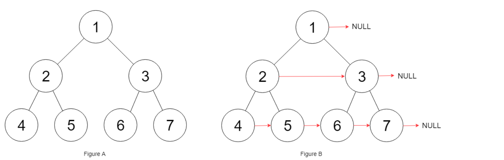

## 题目
给定一个完美二叉树，其所有叶子节点都在同一层，每个父节点都有两个子节点。二叉树定义如下：

```
struct Node {
  int val;
  Node *left;
  Node *right;
  Node *next;
}
```
填充它的每个 next 指针，让这个指针指向其下一个右侧节点。如果找不到下一个右侧节点，则将 next 指针设置为 NULL。

初始状态下，所有 next 指针都被设置为 NULL。

**示例1**

```
输入：{"$id":"1","left":{"$id":"2","left":{"$id":"3","left":null,"next":null,"right":null,"val":4},"next":null,"right":{"$id":"4","left":null,"next":null,"right":null,"val":5},"val":2},"next":null,"right":{"$id":"5","left":{"$id":"6","left":null,"next":null,"right":null,"val":6},"next":null,"right":{"$id":"7","left":null,"next":null,"right":null,"val":7},"val":3},"val":1}

输出：{"$id":"1","left":{"$id":"2","left":{"$id":"3","left":null,"next":{"$id":"4","left":null,"next":{"$id":"5","left":null,"next":{"$id":"6","left":null,"next":null,"right":null,"val":7},"right":null,"val":6},"right":null,"val":5},"right":null,"val":4},"next":{"$id":"7","left":{"$ref":"5"},"next":null,"right":{"$ref":"6"},"val":3},"right":{"$ref":"4"},"val":2},"next":null,"right":{"$ref":"7"},"val":1}

解释：给定二叉树如图 A 所示，你的函数应该填充它的每个 next 指针，以指向其下一个右侧节点，如图 B 所示。
```

**提示**
* 你只能使用常量级额外空间。
* 使用递归解题也符合要求，本题中递归程序占用的栈空间不算做额外的空间复杂度。

## 代码(层序遍历迭代)
```C++
/*
// Definition for a Node.
class Node {
public:
    int val;
    Node* left;
    Node* right;
    Node* next;

    Node() : val(0), left(NULL), right(NULL), next(NULL) {}

    Node(int _val) : val(_val), left(NULL), right(NULL), next(NULL) {}

    Node(int _val, Node* _left, Node* _right, Node* _next)
        : val(_val), left(_left), right(_right), next(_next) {}
};
*/
class Solution {
public:
    Node* connect(Node* root) {
        if(!root){
            return NULL;
        }
        queue<Node*> q;
        q.push(root);
        while(!q.empty()){
            int size = q.size();
            for(int i = 0;i < size;i++){
                Node* current = q.front();
                q.pop();
                if(i < size - 1){
                    current->next = q.front();
                }else{
                    current->next = NULL;
                }
                if(current->left != NULL){
                    q.push(current->left);
                }
                if(current->right != NULL){
                    q.push(current->right);
                }
            }
        }
        return root;
    }
};
```

## 代码(利用next迭代)
```C++
/*
// Definition for a Node.
class Node {
public:
    int val;
    Node* left;
    Node* right;
    Node* next;

    Node() : val(0), left(NULL), right(NULL), next(NULL) {}

    Node(int _val) : val(_val), left(NULL), right(NULL), next(NULL) {}

    Node(int _val, Node* _left, Node* _right, Node* _next)
        : val(_val), left(_left), right(_right), next(_next) {}
};
*/
class Solution {
public:
    Node* connect(Node* root) {
        if (!root) {
            return NULL;
        }
        // Start with the root node. There are no next pointers
        // that need to be set up on the first level
        Node* leftmost = root;
        // Once we reach the final level, we are done
        while (leftmost->left != NULL) {
            
            // Iterate the "linked list" starting from the head
            // node and using the next pointers, establish the 
            // corresponding links for the next level
            Node* head = leftmost;
            
            while (head != NULL) {
                
                // CONNECTION 1
                head->left->next = head->right;
                
                // CONNECTION 2
                if (head->next != NULL) {
                    head->right->next = head->next->left;
                }
                
                // Progress along the list (nodes on the current level)
                head = head->next;
            }
            
            // Move onto the next level
            leftmost = leftmost->left;
        }
        
        return root;  
    }
};
```

## 代码(递归)
```C++
/*
// Definition for a Node.
class Node {
public:
    int val;
    Node* left;
    Node* right;
    Node* next;

    Node() : val(0), left(NULL), right(NULL), next(NULL) {}

    Node(int _val) : val(_val), left(NULL), right(NULL), next(NULL) {}

    Node(int _val, Node* _left, Node* _right, Node* _next)
        : val(_val), left(_left), right(_right), next(_next) {}
};
*/
class Solution {
public:
    Node* connect(Node* root) {
        if (!root) return root;
        root->next = NULL;
        help(root);
        return root;
    }
    
    void help(Node* root) {
        if (root->left) {
            root->left->next = root->right;
            if (root->next) {
                root->right->next = root->next->left;
            }
            help(root->left);
            help(root->right);
        }
    } 
};
```
## 思路

### 解法1

最简单的就是利用bfs层次遍历一下，然后在遍历过程中处理一下next即可。不过由于使用了辅助队列，所以时间复杂度是`O(N)`的。

### 解法2

其实也可以利用next指针来迭代降低时间复杂度。具体实现可以参考这个[博客](https://leetcode-cn.com/problems/populating-next-right-pointers-in-each-node/solution/tian-chong-mei-ge-jie-dian-de-xia-yi-ge-you-ce-j-3/)

精髓就是两行代码
```
head->left->next = head->right;

head->right->next = head->next->left;
```

* 时间复杂度：`O(N)`，每个节点只访问一次。
* 空间复杂度：`O(1)`，不需要存储额外的节点。

### 解法3

递归做法和解法2比较像，也大概是那个意思，精髓也是那两行代码。