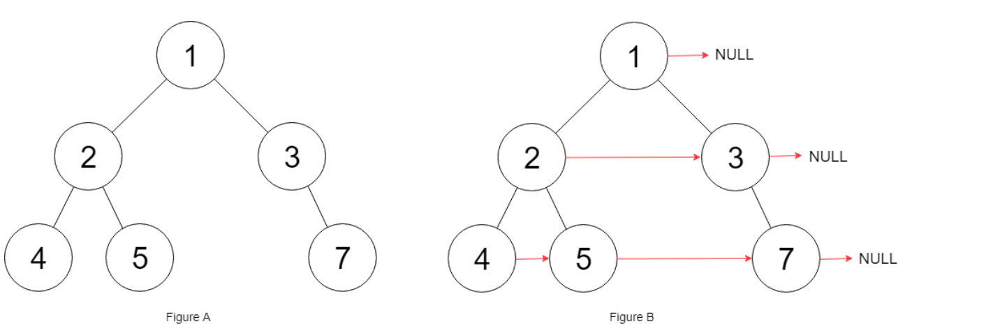

## 题目
给定一个二叉树，二叉树定义如下：
```
struct Node {
  int val;
  Node *left;
  Node *right;
  Node *next;
}
```
填充它的每个 next 指针，让这个指针指向其下一个右侧节点。如果找不到下一个右侧节点，则将 next 指针设置为 NULL。

初始状态下，所有 next 指针都被设置为 NULL。

**示例1**

```
输入：root = [1,2,3,4,5,null,7]
输出：[1,#,2,3,#,4,5,7,#]
解释：给定二叉树如图 A 所示，你的函数应该填充它的每个 next 指针，以指向其下一个右侧节点，如图 B 所示。
```

**提示**
* 你只能使用常量级额外空间。
* 使用递归解题也符合要求，本题中递归程序占用的栈空间不算做额外的空间复杂度。
* 树中的节点数小于 6000
* `-100 <= node.val <= 100`

## 代码(层序遍历+辅助队列迭代)
```C++
/*
// Definition for a Node.
class Node {
public:
    int val;
    Node* left;
    Node* right;
    Node* next;

    Node() : val(0), left(NULL), right(NULL), next(NULL) {}

    Node(int _val) : val(_val), left(NULL), right(NULL), next(NULL) {}

    Node(int _val, Node* _left, Node* _right, Node* _next)
        : val(_val), left(_left), right(_right), next(_next) {}
};
*/
class Solution {
public:
    Node* connect(Node* root) {
        if(!root){
            return NULL;
        }
        queue<Node*> q;
        q.push(root);
        while(!q.empty()){
            int size = q.size();
            for(int i = 0;i < size;i++){
                Node* current = q.front();
                q.pop();
                if(i < size - 1){
                    current->next = q.front();
                }else{
                    current->next = NULL;
                }
                if(current->left != NULL){
                    q.push(current->left);
                }
                if(current->right != NULL){
                    q.push(current->right);
                }
            }
        }
        return root;
    }
};
```

## 代码(层序遍历+利用next迭代)
```C++
/*
// Definition for a Node.
class Node {
public:
    int val;
    Node* left;
    Node* right;
    Node* next;

    Node() : val(0), left(NULL), right(NULL), next(NULL) {}

    Node(int _val) : val(_val), left(NULL), right(NULL), next(NULL) {}

    Node(int _val, Node* _left, Node* _right, Node* _next)
        : val(_val), left(_left), right(_right), next(_next) {}
};
*/
class Solution {
public:

    Node* connect(Node* root) {
        Node* head = root;
        while(head){
            Node* cur = head;
            Node* pre = head = NULL;
            while(cur){
                if(cur->left){
                   if (!pre){
                       pre = head = cur->left;
                   }else{
                       pre->next = cur->left;
                       pre = pre->next;
                   } 
                }
                if(cur->right){
                   if (!pre){
                       pre = head = cur->right;
                   }else{
                       pre->next = cur->right;
                       pre = pre->next;
                   } 
                }
                cur = cur->next;
            }
        }
        return root;
    }
};
```

## 代码(递归)
```C++
/*
// Definition for a Node.
class Node {
public:
    int val;
    Node* left;
    Node* right;
    Node* next;

    Node() : val(0), left(NULL), right(NULL), next(NULL) {}

    Node(int _val) : val(_val), left(NULL), right(NULL), next(NULL) {}

    Node(int _val, Node* _left, Node* _right, Node* _next)
        : val(_val), left(_left), right(_right), next(_next) {}
};
*/
class Solution {
public:

    Node* connect(Node* root) {
        if (root == NULL || (root->right == NULL && root->left == NULL)) {
            return root;
        }
        if (root->left != NULL && root->right != NULL) {
            root->left->next = root->right;
            root->right->next = getNextNoNullChild(root);
        }
        if (root->left == NULL) {
            root->right->next = getNextNoNullChild(root);
        }
        if (root->right == NULL) {
            root->left->next = getNextNoNullChild(root);
        }

        //这里要注意：先递归右子树，否则右子树根节点next关系没建立好，左子树到右子树子节点无法正确挂载
        root->right = connect(root->right);
        root->left = connect(root->left);

        return root;
    }

    /**
     * 一路向右找到有子节点的根节点
     */
    Node* getNextNoNullChild(Node* root) {
        while (root->next != NULL) {
            if (root->next->left != NULL) {
                return root->next->left;
            }
            if (root->next->right != NULL) {
                return root->next->right;
            }
            root = root->next;
        }
        return NULL;
    }
};
```
## 思路

### 解法1

最简单的就是利用bfs层次遍历一下，然后在遍历过程中处理一下next即可。不过由于使用了辅助队列，所以时间复杂度是`O(N)`的。

### 解法2

定义3个变量，分别标记：下一层头节点head，下一层已遍历到的前置节点pre，以及当前层处理的游标cur：

* 总初始化：下一层要处理的头节点head=root
* 各层初始化：当前层处理游标节点cur用head更新赋值，而后pre=head=None，表示下一层尚未找到前置和头节点
* 对当前层游标节点cur进行处理，对左右子节点分别判断：
    * 如果下一层尚未找到前置节点，则意味着该左/右子节点就是下一层的头节点，于是更新pre=head=该子节点
    * 如果pre已赋值，则直接更新pre的next到当前的左/右子节点，然后pre更新到其next值
* 处理下一层

### 解法3

可以使用递归做法，核心是getNextNoNullChild函数，根据root，找到下一级右边第一个。然后分情况讨论，对每个节点：
* 左子右子都有，则左子next指向右子，右子next指向getNextNoNullChild
* 只有左子，左子指向getNextNoNullChild，
* 只有右子，右子指向getNextNoNullChild，

需要注意递归时先递归右子树，否则右子树的next关系没建立好，左子树到右子树子节点无法正确挂载。
