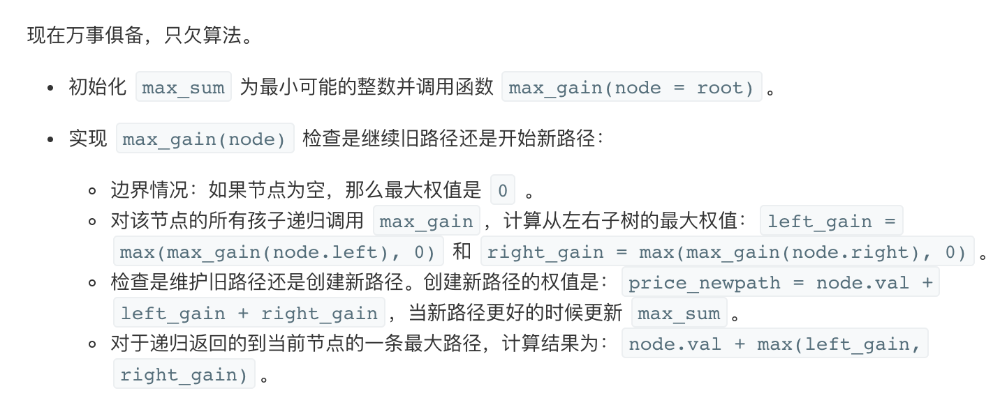

## 题目
给定一个非空二叉树，返回其最大路径和。

本题中，路径被定义为一条从树中任意节点出发，达到任意节点的序列。该路径至少包含一个节点，且不一定经过根节点。

**示例1**
```
输入: [1,2,3]

       1
      / \
     2   3

输出: 6
```

**示例2**
```
输入: [-10,9,20,null,null,15,7]

   -10
   / \
  9  20
    /  \
   15   7

输出: 42
```

## 代码
```Java
/**
 * Definition for a binary tree node.
 * public class TreeNode {
 *     int val;
 *     TreeNode left;
 *     TreeNode right;
 *     TreeNode() {}
 *     TreeNode(int val) { this.val = val; }
 *     TreeNode(int val, TreeNode left, TreeNode right) {
 *         this.val = val;
 *         this.left = left;
 *         this.right = right;
 *     }
 * }
 */
class Solution {
    int maxValue = Integer.MIN_VALUE;

    public int maxPathSum(TreeNode root) {
        maxCount(root);
        return maxValue;
    }

    public int maxCount(TreeNode root){
        if (root == null){
            return 0;
        }
        int leftMax = Math.max(maxCount(root.left), 0);
        int rightMax = Math.max(maxCount(root.right), 0);
        maxValue = Math.max(maxValue, root.val + leftMax + rightMax);
        return root.val + Math.max(leftMax, rightMax);
    }
}
```
## 思路
如果只是计算值得话还不算特别难，用以下巧妙的算法能够解决。但是如果要找到所有节点就比较棘手了。

* 时间复杂度：O(N) 其中 N 是结点个数。我们对每个节点访问不超过 2 次。
* 空间复杂度：O(log(N))。我们需要一个大小与树的高度相等的栈开销，对于二叉树空间开销是 O(log(N))。