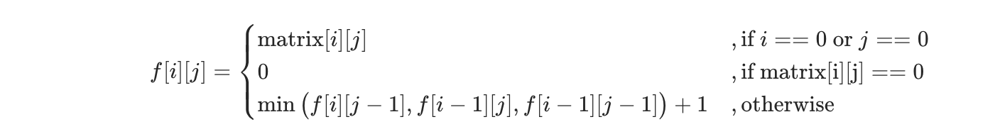

## 题目
给你一个 m * n 的矩阵，矩阵中的元素不是 0 就是 1，请你统计并返回其中完全由 1 组成的 正方形 子矩阵的个数。

**示例 1**
```
输入：matrix =
[
  [0,1,1,1],
  [1,1,1,1],
  [0,1,1,1]
]
输出：15
解释： 
边长为 1 的正方形有 10 个。
边长为 2 的正方形有 4 个。
边长为 3 的正方形有 1 个。
正方形的总数 = 10 + 4 + 1 = 15.
```

**示例 2**
```
输入：matrix = 
[
  [1,0,1],
  [1,1,0],
  [1,1,0]
]
输出：7
解释：
边长为 1 的正方形有 6 个。 
边长为 2 的正方形有 1 个。
正方形的总数 = 6 + 1 = 7.
```

**说明**
* 1 <= arr.length <= 300
* 1 <= arr[0].length <= 300
* 0 <= arr[i][j] <= 1

## 代码
```JAVA
class Solution {
    public int countSquares(int[][] matrix) {
        int m = matrix.length;
        int n = matrix[0].length;
        int[][] count = new int[m][n];
        int result = 0;
        for(int i = 0;i < m;i++){
            for(int j = 0;j < n;j++){
                if(i == 0 || j == 0) {
                    count[i][j] = matrix[i][j];
                } else if (matrix[i][j] == 0) {
                    count[i][j] = 0;
                } else {
                    count[i][j] = Math.min(count[i][j - 1], Math.min(count[i - 1][j], count[i - 1][j - 1])) + 1;
                }
                result += count[i][j];
            }
        }
        return result;
    }
}
```

## 思路

使用 dp，空间复杂度和时间复杂度均为 O(M*N)，空间复杂度可以进一步优化。

递推公式如下，证明过程可参考 [博客](https://leetcode.cn/problems/count-square-submatrices-with-all-ones/solution/tong-ji-quan-wei-1-de-zheng-fang-xing-zi-ju-zhen-2/)。

