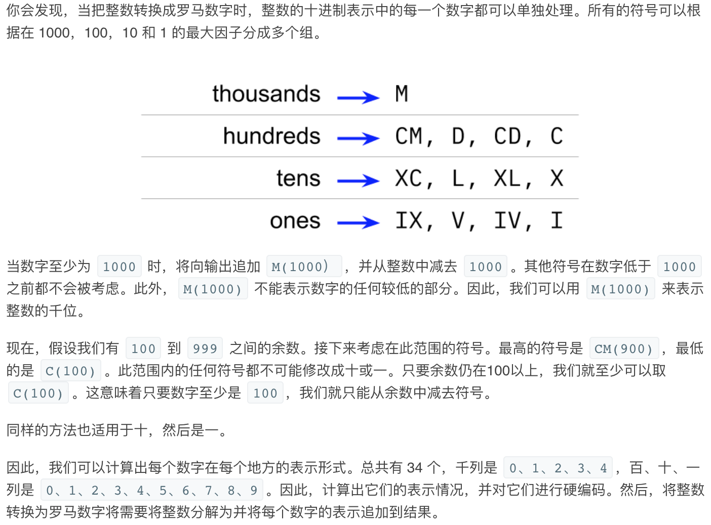
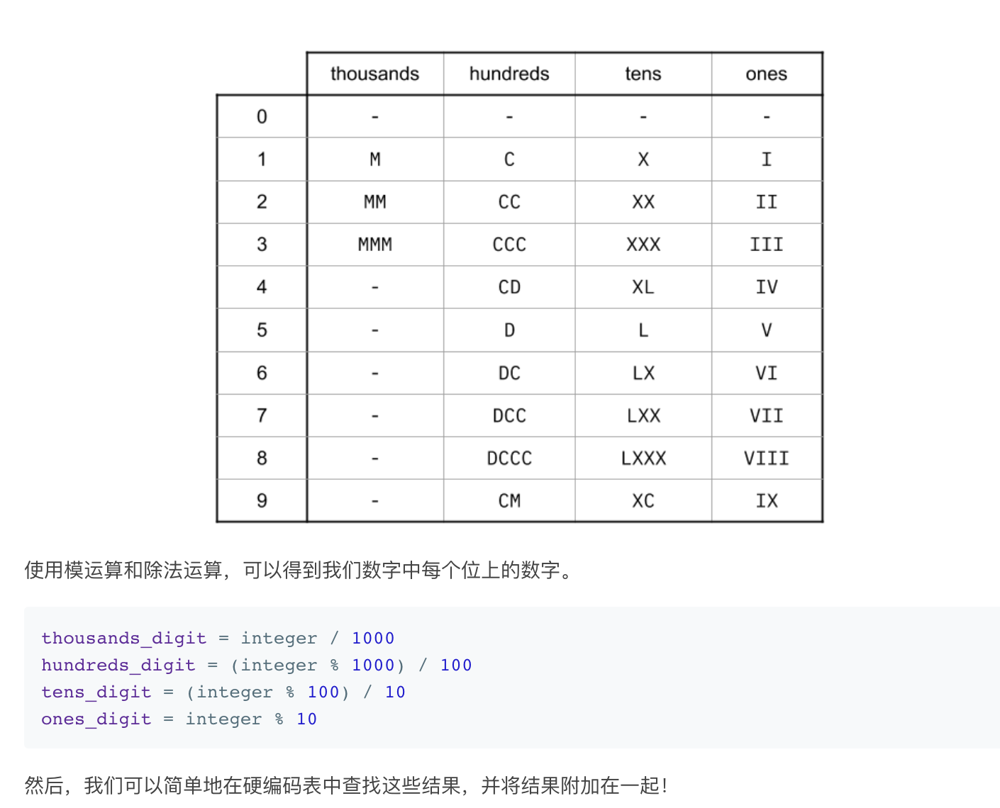

## 题目
罗马数字包含以下七种字符: I， V， X， L，C，D 和 M。
```
字符          数值
I             1
V             5
X             10
L             50
C             100
D             500
M             1000
```
例如， 罗马数字 2 写做 II ，即为两个并列的 1。12 写做 XII ，即为 X + II 。 27 写做  XXVII, 即为 XX + V + II 。

通常情况下，罗马数字中小的数字在大的数字的右边。但也存在特例，例如 4 不写做 IIII，而是 IV。数字 1 在数字 5 的左边，所表示的数等于大数 5 减小数 1 得到的数值 4 。同样地，数字 9 表示为 IX。这个特殊的规则只适用于以下六种情况：

* I 可以放在 V (5) 和 X (10) 的左边，来表示 4 和 9。
* X 可以放在 L (50) 和 C (100) 的左边，来表示 40 和 90。 
* C 可以放在 D (500) 和 M (1000) 的左边，来表示 400 和 900。
给定一个整数，将其转为罗马数字。输入确保在 1 到 3999 的范围内。

**示例1**
```
输入: 3
输出: "III"
```

**示例2**
```
输入: 4
输出: "IV"
```

**示例3**
```
输入: 9
输出: "IX"
```

**示例4**
```
输入: 58
输出: "LVIII"
解释: L = 50, V = 5, III = 3.
```

**示例5**
```
输入: 1994
输出: "MCMXCIV"
解释: M = 1000, CM = 900, XC = 90, IV = 4.
```

## 代码（贪心）
```JAVA
class Solution {
    int[] values = {1000, 900, 500, 400, 100, 90, 50, 40, 10, 9, 5, 4, 1};    
    String[] symbols = {"M","CM","D","CD","C","XC","L","XL","X","IX","V","IV","I"};

    public String intToRoman(int num) {
        StringBuilder sb = new StringBuilder();
        for(int i = 0;i < values.length && num >= 0;i++){
            while(values[i] <= num){
                num -= values[i];
                sb.append(symbols[i]);
            }
        }
        return sb.toString();
    }
}
```

## 代码（硬编码）
```JAVA
class Solution {
    public String intToRoman(int num) {
    String[] thousands = {"", "M", "MM", "MMM"};
    String[] hundreds = {"", "C", "CC", "CCC", "CD", "D", "DC", "DCC", "DCCC", "CM"}; 
    String[] tens = {"", "X", "XX", "XXX", "XL", "L", "LX", "LXX", "LXXX", "XC"};
    String[] ones = {"", "I", "II", "III", "IV", "V", "VI", "VII", "VIII", "IX"};
    
    return thousands[num / 1000] + hundreds[num % 1000 / 100] + tens[num % 100 / 10] + ones[num % 10];
    }
}
```

## 思路

### 解法1

可以使用贪心做法：即每次首先找到最大的可以满足的罗马数字，将其添加到结果中并对更新后的num继续迭代。

* 时间复杂度：O(1)。由于有一组有限的罗马数字，循环可以迭代多少次有一个硬上限。因此，我们说时间复杂度是常数的，即 O(1)。
* 空间复杂度：O(1)，使用的内存量不会随输入整数的大小而改变，因此是常数的。

### 解法2




* 时间复杂度：O(1)。无论输入的大小，都会执行相同数量的操作。因此，时间复杂度是常数的。
* 空间复杂度：O(1)，虽然我们使用数组，但不管输入的大小，它们都是相同的大小。因此，它们是常数级空间。

这种方法的缺点是，如果要扩展罗马数字，它是不灵活的（这是一个有趣的后续问题）。例如，如果我们说符号 H 现在表示 5000，而 P 现在表示 10000，允许我们表示多达 39999 的数字，就需要添加更多符号，会变的越来越管理。所以第一个方法会更好。