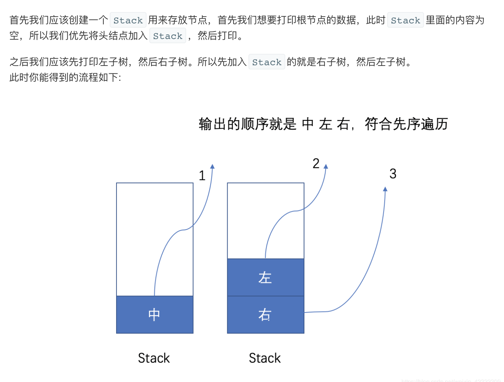

## 题目
给定一个二叉树，返回它的 前序 遍历。

**示例 1**
```
输入：[1,null,2,3]  
   1
    \
     2
    /
   3 

输出：[1,2,3]
```

## 代码（递归法）
```Java
/**
 * Definition for a binary tree node.
 * public class TreeNode {
 *     int val;
 *     TreeNode left;
 *     TreeNode right;
 *     TreeNode() {}
 *     TreeNode(int val) { this.val = val; }
 *     TreeNode(int val, TreeNode left, TreeNode right) {
 *         this.val = val;
 *         this.left = left;
 *         this.right = right;
 *     }
 * }
 */
class Solution {
    List<Integer> res = new ArrayList<>();
    public List<Integer> preorderTraversal(TreeNode root) {
        if(root != null){
            res.add(root.val);
            preorderTraversal(root.left);
            preorderTraversal(root.right);
        }
        return res;
    }
}
```

## 代码（迭代法）
```Java
/**
 * Definition for a binary tree node.
 * public class TreeNode {
 *     int val;
 *     TreeNode left;
 *     TreeNode right;
 *     TreeNode() {}
 *     TreeNode(int val) { this.val = val; }
 *     TreeNode(int val, TreeNode left, TreeNode right) {
 *         this.val = val;
 *         this.left = left;
 *         this.right = right;
 *     }
 * }
 */
class Solution {
    List<Integer> res = new ArrayList<>();
    public List<Integer> preorderTraversal(TreeNode root) {
        if(root != null){
            Stack<TreeNode> stack = new Stack();
            stack.push(root);
            while(!stack.isEmpty()){
                TreeNode cur = stack.pop();
                res.add(cur.val);
                if(cur.right != null){
                    stack.push(cur.right);
                }
                if(cur.left != null){
                    stack.push(cur.left);
                }
            }
        }
        return res;
    }
}
```

## 思路

### 解法 1
使用递归法最简单。

### 解法 2
使用迭代法。


其实还有一种 Morris 做法，空间复杂度最低，但是需要改变树，因此就没写。可以参考此 [博客](https://leetcode-cn.com/problems/binary-tree-preorder-traversal/solution/leetcodesuan-fa-xiu-lian-dong-hua-yan-shi-xbian-2/)