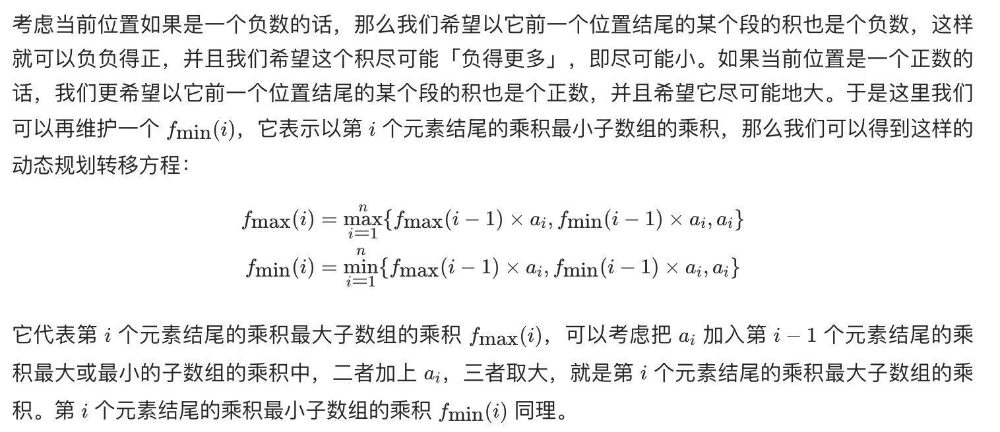

## 题目
给你一个整数数组 nums ，请你找出数组中乘积最大的非空连续子数组（该子数组中至少包含一个数字），并返回该子数组所对应的乘积。

测试用例的答案是一个 32-位 整数。

子数组 是数组的连续子序列。

**示例 1**
```
输入：nums = [2,3,-2,4]
输出：6
解释：子数组 [2,3] 有最大乘积 6。
```

**示例 2**
```
输入：nums = [-2,0,-1]
输出：0
解释：结果不能为 2, 因为 [-2,-1] 不是子数组。
```

**说明**

* 1 <= nums.length <= 2 * 10^4
* -10 <= nums[i] <= 10
* nums 的任何前缀或后缀的乘积都 保证 是一个 32-位 整数

## 代码（普通 dp）
```Java
class Solution {
    public int maxProduct(int[] nums) {
        int[] max = new int[nums.length];
        int[] min = new int[nums.length];
        max[0] = nums[0];
        min[0] = nums[0];
        int result = nums[0];
        for(int i = 1;i < nums.length;i++){
            max[i] = Math.max(nums[i], Math.max(max[i - 1] * nums[i], min[i - 1] * nums[i]));
            min[i] = Math.min(nums[i], Math.min(max[i - 1] * nums[i], min[i - 1] * nums[i]));
            result = Math.max(result, max[i]);
        }
        return result;
    }
}
```

## 代码（优化 dp）
```Java
class Solution {
    public int maxProduct(int[] nums) {
        int max = nums[0];
        int min = nums[0];
        int result = nums[0];
        for(int i = 1;i < nums.length;i++){
            int lastMax = max;
            int lastMin = min;
            max = Math.max(nums[i], Math.max(lastMax * nums[i], lastMin * nums[i]));
            min = Math.min(nums[i], Math.min(lastMax * nums[i], lastMin * nums[i]));
            result = Math.max(result, max);
        }
        return result;
    }
}
```

## 思路

### 解法 1


时间空间复杂度均为 O(N)。

### 解法 2

由于 dp 时仅仅依赖上一个结果，因而空间复杂度可以进一步优化为 O(1)。