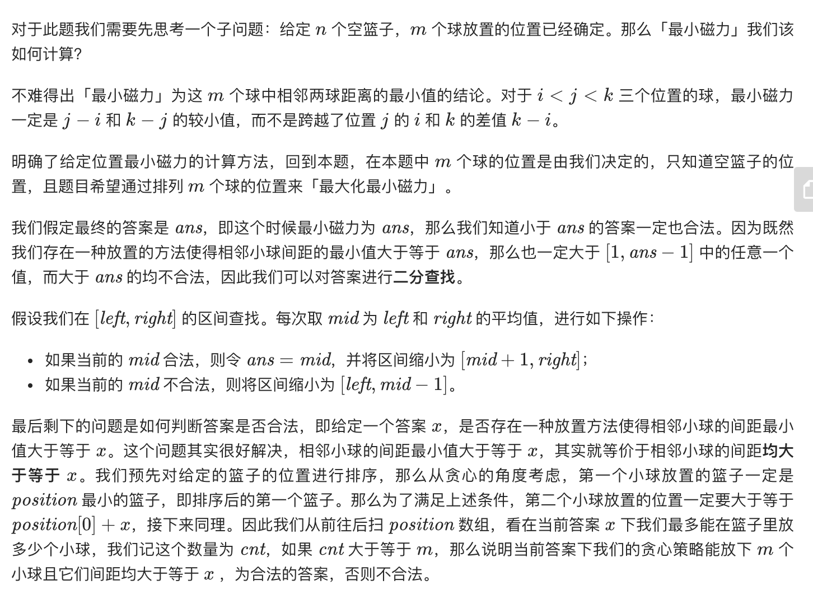
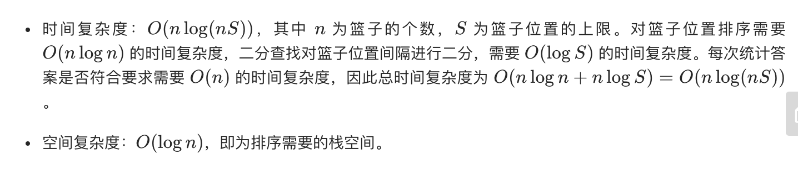

## 题目
在代号为 C-137 的地球上，Rick 发现如果他将两个球放在他新发明的篮子里，它们之间会形成特殊形式的磁力。Rick 有 n 个空的篮子，第 i 个篮子的位置在 position[i] ，Morty 想把 m 个球放到这些篮子里，使得任意两球间 最小磁力 最大。

已知两个球如果分别位于 x 和 y ，那么它们之间的磁力为 |x - y| 。

给你一个整数数组 position 和一个整数 m ，请你返回最大化的最小磁力

**示例1**

```
输入：position = [1,2,3,4,7], m = 3
输出：3
解释：将 3 个球分别放入位于 1，4 和 7 的三个篮子，两球间的磁力分别为 [3, 3, 6]。最小磁力为 3 。我们没办法让最小磁力大于 3 。
```

**示例2**
```
输入：position = [5,4,3,2,1,1000000000], m = 2
输出：999999999
解释：我们使用位于 1 和 1000000000 的篮子时最小磁力最大。
```

**说明**
* `n == position.length`
* `2 <= n <= 10^5`
* `1 <= position[i] <= 10^9`
* 所有 position 中的整数 互不相同 。
* `2 <= m <= position.length`

## 代码
```JAVA
class Solution {
    public int maxDistance(int[] position, int m) {
        Arrays.sort(position);
        int low = 1;
        int high = (position[position.length - 1] - position[0]) / (m - 1);
        while(low <= high){
            int mid = low + (high - low) / 2;
            if(checkValid(position, m, mid)){
                low = mid + 1;
            }else{
                high = mid - 1;
            }
        }
        return high;
    }

    private boolean checkValid(int[] position, int m, int distance){
        int pre = position[0];
        int cnt = 1;
        for(int i = 1;i < position.length;i++){
            if(position[i] - pre >= distance){
                pre = position[i];
                cnt++;
            }
        }
        return cnt >= m;
    }
}
```

## 思路

这题一下子不容易想到二分，可以参看以下解释。注意二分的写法，防止mid溢出以及最后返回正确的元素。

