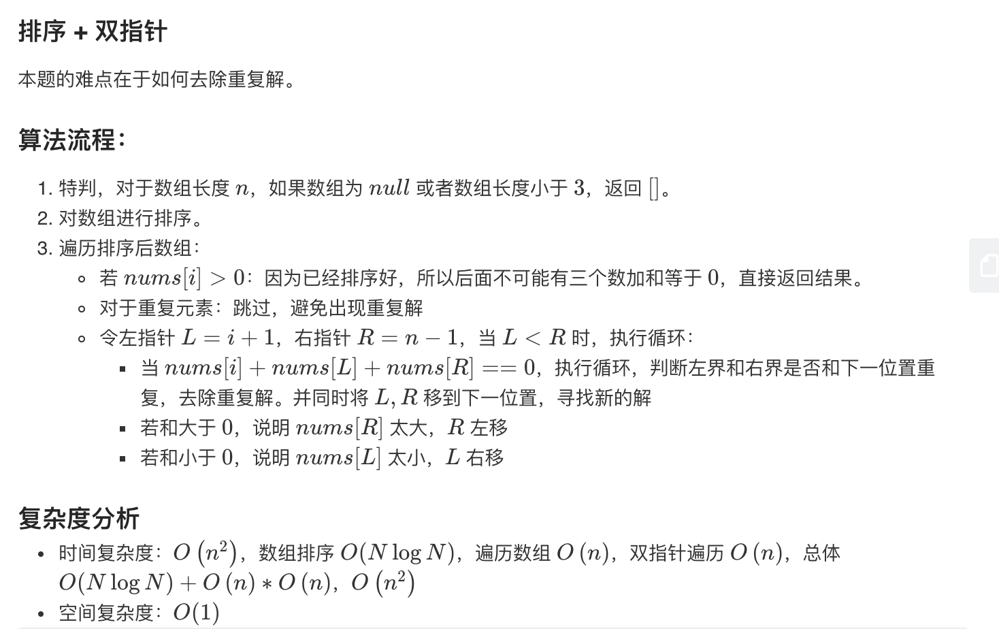

## 题目
给你一个包含 n 个整数的数组 nums，判断 nums 中是否存在三个元素 a，b，c ，使得 a + b + c = 0 ？请你找出所有满足条件且不重复的三元组。

注意：答案中不可以包含重复的三元组。

**示例1**
```
给定数组 nums = [-1, 0, 1, 2, -1, -4]，

满足要求的三元组集合为：
[
  [-1, 0, 1],
  [-1, -1, 2]
]
```

## 代码
```JAVA
class Solution {
    final long target = 0;
    public List<List<Integer>> threeSum(int[] nums) {
        List<List<Integer>> res = new ArrayList<>();
        if(nums.length < 3){
            return res;
        }
        Arrays.sort(nums);
        for(int i = 0;i < nums.length - 2;i++){
            if(nums[i] + nums[i+1] + nums[i+2] > target){
                break;
            }
            if(i > 0 && nums[i] == nums[i-1]){
                continue;
            }
            int left = i + 1;
            int right = nums.length - 1;
            while(left < right){
                long sum = (long)nums[i] + (long)nums[left] + (long)nums[right];
                if(sum == target){
                    List<Integer> row = new ArrayList();
                    row.addAll(Arrays.asList(nums[i],nums[left],nums[right]));
                    res.add(row);
                    while(left < right && nums[left] == nums[left + 1]){
                        left++;
                    }
                    while(left < right && nums[right] == nums[right - 1]){
                        right--;
                    }
                    left++;
                    right--;
                }else if(sum < target){
                    left++;
                }else{
                    right--;
                }
            }
        }
        return res;
    }
}
```
## 思路

经典题目，方法大致是这样。



实际在写的时候有许多可以优化的小点。

可以参考[博客](https://leetcode-cn.com/problems/3sum/solution/pai-xu-shuang-zhi-zhen-zhu-xing-jie-shi-python3-by/)