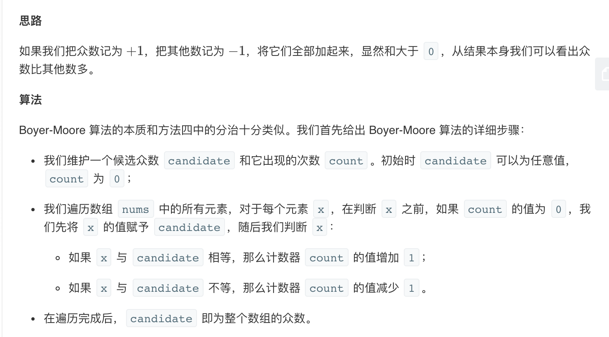

## 题目
给定一个大小为 n 的数组，找到其中的多数元素。多数元素是指在数组中出现次数大于 ⌊ n/2 ⌋ 的元素。

你可以假设数组是非空的，并且给定的数组总是存在多数元素。

**示例 1**
```
输入：[3,2,3]
输出：3
```

**示例 2**
```
输入：[2,2,1,1,1,2,2]
输出：2
```

## 代码（哈希做法）
```JAVA 
class Solution {
    public int majorityElement(int[] nums) {
        Map<Integer, Integer> counts = new HashMap<>();
        for(int num : nums){
            int count = counts.getOrDefault(num , 0) + 1;
            if(count > nums.length / 2) {
                return num;
            }
            counts.put(num, count);
        }
        return 0;
    }
}
```

## 代码 (Boyer-Moore 投票算法）
```JAVA
class Solution {
    public int majorityElement(int[] nums) {
        int candidate = -1;
        int count = 0;
        for(int num : nums){
            if(count == 0) candidate = num;
            count += num == candidate ? 1 : -1;
        }
        return candidate;
    }
}
```

## 思路

解法比较多，列了最容易想出来的和最优的解法。更多解法可以参考此 [博客](https://leetcode-cn.com/problems/majority-element/solution/duo-shu-yuan-su-by-leetcode-solution/)

### 解法 1
最简单的做法就是搞个哈希遍历判断一下。

* 时间复杂度：O(N)
* 空间复杂度：O(N)

### 解法 2
这个解法不容易证明，但是是最优的。

需要注意的是此算法必须建立数组中确认存在众数才正确。如果不确定的话还需要在结尾遍历一下数组判断一下 candidate 是否满足众数的条件才可判断十足是否真的存在众数。

* 时间复杂度：O(N)
* 空间复杂度：O(1)
