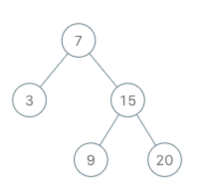

## 题目
实现一个二叉搜索树迭代器。你将使用二叉搜索树的根节点初始化迭代器。

调用`next()`将返回二叉搜索树中的下一个最小的数。

**示例**

```
BSTIterator iterator = new BSTIterator(root);
iterator.next();    // 返回 3
iterator.next();    // 返回 7
iterator.hasNext(); // 返回 true
iterator.next();    // 返回 9
iterator.hasNext(); // 返回 true
iterator.next();    // 返回 15
iterator.hasNext(); // 返回 true
iterator.next();    // 返回 20
iterator.hasNext(); // 返回 false
```

**提示**
* `next()` 和 `hasNext()` 操作的时间复杂度是 `O(1)`，并使用 `O(h)` 内存，其中 h 是树的高度。
你可以假设 `next()` 调用总是有效的，也就是说，当调用 `next()` 时，BST 中至少存在一个下一个最小的数。

## 代码
```C++
/**
 * Definition for a binary tree node.
 * struct TreeNode {
 *     int val;
 *     TreeNode *left;
 *     TreeNode *right;
 *     TreeNode(int x) : val(x), left(NULL), right(NULL) {}
 * };
 */
class BSTIterator {
public:
    stack<TreeNode*> s;
    BSTIterator(TreeNode* root) {
        build(root);
    }
    
    void build(TreeNode* root){
        while(root){
            s.push(root);
            root = root->left;
        }
    }
    
    /** @return the next smallest number */
    int next() {
        TreeNode* node = s.top();
        s.pop();
        if(node->right){
            build(node->right);
        }
        return node->val;
    }
    
    /** @return whether we have a next smallest number */
    bool hasNext() {
        return !s.empty();
    }
};

/**
 * Your BSTIterator object will be instantiated and called as such:
 * BSTIterator* obj = new BSTIterator(root);
 * int param_1 = obj->next();
 * bool param_2 = obj->hasNext();
 */
```
## 思路

这题其实最简单就是初始化的时候中序遍历一下，然后就能使得`next()`和`hasNext()`时间复杂度是`O(1)`了，这样实现起来也最简单，但是这样的空间复杂度是`O(n)`而不是`O(h)`。因此不满足题意，这预示者我们要对迭代进度进行一下控制，让其没必要一开始就占用这么多空间。即我们可以搞一下受控迭代。

算法如下：

1. 初始化一个空栈 S，用于模拟二叉搜索树的中序遍历。中序遍历我们采用与之前相同的方法，只是我们现在使用的是自己的栈而不是系统的堆栈。由于我们使用自定义的数据结构，因此可以随时暂停和恢复递归。
2. 我们还要实现一个帮助函数，在实现中将一次又一次的调用它。这个函数叫 build，它将给定节点中的所有左子节点添加到栈中，直到节点没有左子节点为止。
3. 第一次调用 `next()` 函数时，必须返回二叉搜索树的最小元素，然后我们模拟递归必须向前移动一步，即移动到二叉搜索树的下一个最小元素上。栈的顶部始终包含 `next()` 函数返回的元素。`hasNext()` 很容易实现，因为我们只需要检查栈是否为空。
4. 首先，给定二叉搜索树的根节点，我们调用函数 build，这确保了栈顶部始终包含了 `next()` 函数返回的元素。
5. 假设我们调用 `next()`，我们需要返回二叉搜索树中的下一个最小元素，即栈的顶部元素。有两种可能性：
    * 一个是栈顶部的节点是一个叶节点。这是最好的情况，因为我们什么都不用做，只需将节点从栈中弹出并返回其值。所以这是个常数时间的操作。
    * 另一个情况是栈顶部的节点拥有右节点。我们不需要检查左节点，因为左节点已经添加到栈中了。栈顶元素要么没有左节点，要么左节点已经被处理了。如果栈顶部拥有右节点，那么我们需要对右节点上调用帮助函数。该时间复杂度取决于树的结构。
6. `next()` 函数调用中，获取下一个最小的元素不需要花太多时间，但是要保证栈顶元素是 `next()` 函数返回的元素方面花费了一些时间。


* 时间复杂度：
    * `hasNext()`：若栈中还有元素，则返回 true，反之返回 false。所以这是一个 `O(1)` 的操作。
    * `next()`：包含了两个主要步骤。一个是从栈中弹出一个元素，它是下一个最小的元素。这是一个 `O(1)` 的操作。然而，随后我们要调用帮助函数 build ，它需要递归的，将左节点添加到栈上，是线性时间的操作，最坏的情况下为`O(N)`。但是我们只对含有右节点的节点进行调用，它也不会总是处理 N 个节点。只有当我们有一个倾斜的树，才会有 N 个节点。因此该操作的均摊时间复杂度仍然是 `O(1)`，符合问题中所要求的。
* 空间复杂度：`O(h)`，使用了一个栈来模拟递归。


