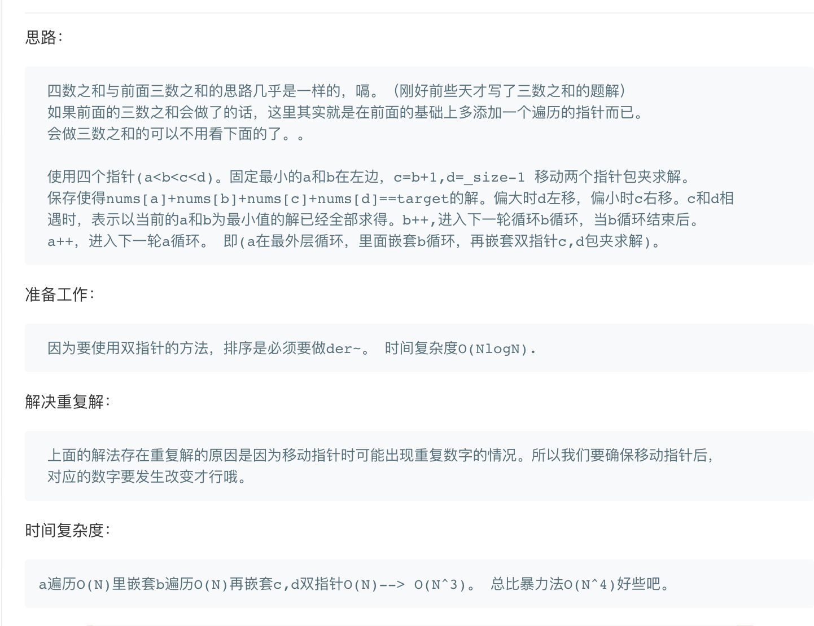

## 题目
给定一个包含 n 个整数的数组 nums 和一个目标值 target，判断 nums 中是否存在四个元素 a，b，c 和 d ，使得 a + b + c + d 的值与 target 相等？找出所有满足条件且不重复的四元组。

**示例1**
```
给定数组 nums = [1, 0, -1, 0, -2, 2]，和 target = 0。

满足要求的四元组集合为：
[
  [-1,  0, 0, 1],
  [-2, -1, 1, 2],
  [-2,  0, 0, 2]
]
```

## 代码（普通解法）
```C++
class Solution {
public:
    vector<vector<int>> fourSum(vector<int>& nums, int target) {
        vector<vector<int>> res;
        int len = nums.size();
        if(len < 4){
            return res;
        }
        sort(nums.begin(),nums.end());
        for (int i = 0; i < len - 3; i++) {
            if (nums[i] + nums[i + 1] + nums[i + 2] + nums[i + 3] > target) break;
            if (i > 0 && nums[i] == nums[i - 1]) continue;
            for (int j = i + 1; j < len - 2; j++) {
                if (j > i + 1 && nums[j] == nums[j - 1]) continue;
                int k = j + 1;
                int l = len - 1;
                int min = nums[i] + nums[j] + nums[k] + nums[k + 1];
                if (min > target) break;//最小值都大于terget
                int max = nums[i] + nums[l-2] + nums[l - 1] + nums[l];
                if (max < target) break;//最大值都小于terget
                while (k < l) {
                    long sum = (long)nums[i] + (long)nums[j] + (long)nums[k] + (long)nums[l];
                    if (sum > target)
                        l--;
                    else if (sum < target)
                        k++;
                    else if (sum == target) {
                        res.push_back({nums[i], nums[j], nums[k], nums[l]});
                        while (k < l && nums[k] == nums[k + 1]) k++;
                        while (k < l && nums[l] == nums[l - 1]) l--;
                        k++;
                        l--;
                    }
                }
            }
        }
        return res;
    }
};
```

## 代码（NSum 通用解法）
```C++
class Solution {
public:
    vector<vector<int>> res;
    vector<int> nums;
    vector<vector<int>> fourSum(vector<int>& nums, int target) {
        int len = nums.size();
        if(len < 4){
            return res;
        }
        sort(nums.begin(),nums.end());
        this->nums = nums;
        vector<int> cur;
        dfs(0, target, 4, cur);
        return res;
    }
    
    void dfs(int pos, int target, int n, vector<int>& cur){
        if(n == 2){
            int left = pos;
            int right = nums.size() - 1;
            while(left < right){
                long sum = (long)nums[left] + (long)nums[right];
                if(sum < target){
                    left++;
                }else if (sum > target){
                    right--;
                }else{
                    //此处重新赋值可以使得参数cur使用引用，从而避免大量的无用复制，大幅度提高效率。
                    vector<int> tmp(cur.begin(),cur.end());
                    tmp.push_back(nums[left]);
                    tmp.push_back(nums[right]);
                    res.push_back(tmp);
                    while(left < right && nums[left] == nums[left + 1])
                        left++;
                    while(left < right && nums[right] == nums[right - 1])
                        right--;
                    left++;
                    right--;
                }
            }
            return;
        }
        int i = pos;
        while(i < nums.size() - n + 1){
            if(nums[i] * n > target && nums[nums.size() - 1] * n < target){
                break;
            }
            if(i > pos && nums[i] == nums[i - 1]){
                i++;
                continue;
            }
            cur.push_back(nums[i]);
            dfs(i + 1, target - nums[i],n - 1,cur);
            cur.pop_back();
            i++;
        }
    }
};
```

## 思路

## 解法1

可以参照三数之和的做法。

可以做一点小优化使得某些情况早早的退出来。
可以参考此[博客](https://leetcode-cn.com/problems/4sum/solution/shuang-zhi-zhen-jie-fa-can-zhao-san-shu-zhi-he-ge-/)

### 解法2

其实通过做2sum，3sum也可以发现这类题都有共性，因此可以抽象出一个共性的做法。可以用上面的做法也可以用[这里](https://leetcode-cn.com/explore/orignial/card/all-about-lockup-table/238/lookup-table-related-sum-questions/996/)的做法