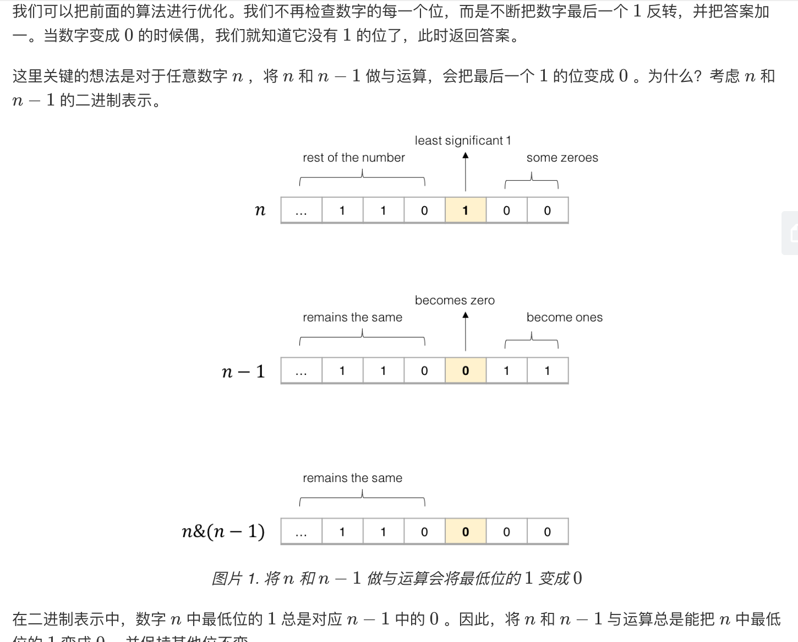

## 题目
编写一个函数，输入是一个无符号整数，返回其二进制表达式中数字位数为 ‘1’ 的个数（也被称为汉明重量）。

**示例 1**
```
输入：00000000000000000000000000001011
输出：3
解释：输入的二进制串 00000000000000000000000000001011 中，共有三位为 '1'。
```

**示例 2**
```
输入：11111111111111111111111111111101
输出：31
解释：输入的二进制串 11111111111111111111111111111101 中，共有 31 位为 '1'。
```

**示例 3**
```
输入：00000000000000000000000010000000
输出：1
解释：输入的二进制串 00000000000000000000000010000000 中，共有一位为 '1'。
```

**提示**
* 请注意，在某些语言（如 Java）中，没有无符号整数类型。在这种情况下，输入和输出都将被指定为有符号整数类型，并且不应影响您的实现，因为无论整数是有符号的还是无符号的，其内部的二进制表示形式都是相同的。
* 在 Java 中，编译器使用二进制补码记法来表示有符号整数。因此，在上面的 示例 3 中，输入表示有符号整数 -3。

**进阶**
* 如果多次调用这个函数，你将如何优化你的算法？

## 代码（位操作）
```Java
public class Solution {
    // you need to treat n as an unsigned value
    public int hammingWeight(int n) {
        int res = 0;
        while(n != 0){
            res += n & 1;
            n >>>= 1;
        }
        return res;
    }
}
```

## 代码（位操作优化）
```Java
public class Solution {
    // you need to treat n as an unsigned value
    public int hammingWeight(int n) {
        int res = 0;
        while(n != 0){
            res ++;
            n = n & (n - 1);
        }
        return res;
    }
}
```

## 代码（位操作极致优化）
```Java
public class Solution {
    // you need to treat n as an unsigned value
    public int hammingWeight(int i) {
        i = i - ((i >>> 1) & 0x55555555);
        i = (i & 0x33333333) + ((i >>> 2) & 0x33333333);
        i = (i + (i >>> 4)) & 0x0f0f0f0f;
        i = i + (i >>> 8);
        i = i + (i >>> 16);
        return i & 0x3f;
    }
}
```

## 思路

### 解法 1
计组的知识，没啥好说的。有关 java 的算术右移和逻辑右移可以参考此 [博客](https://leetcode-cn.com/problems/number-of-1-bits/solution/fu-xue-ming-zhu-xiang-jie-wei-yun-suan-f-ci7i/)。

* 时间复杂度：O(1)。具体迭代次数依赖于数字 n 在 2 进制位中最大的 1 所在的位置。最好为 1 次，最差为 31 次。
* 空间复杂度：O(1)。没有使用额外空间。

### 解法 2
这个优化比较有意思，虽然都是 O(1) 但是确实能够减少一些运算。

* 时间复杂度：O(1)。具体迭代次数依赖于数字 n 在 2 进制位中 1 的个数。最好为 1 次，最差为 31 次。但迭代次数一定不比上面的多。
* 空间复杂度：O(1)。没有使用额外空间。

### 解法 3
此算法是 Integer.bitCount() 库函数的自带算法，利用归并的方式可以进一步减少运算次数，具体可以参考此 [博客](https://segmentfault.com/a/1190000015763941)。
* 时间复杂度：O(1)。运算次数固定，不与 1 的个数有关。
* 空间复杂度：O(1)。没有使用额外空间。