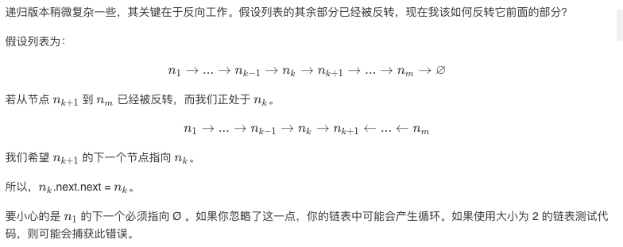

## 题目
反转一个单链表。

**示例1**
```
输入: 1->2->3->4->5->NULL
输出: 5->4->3->2->1->NULL
```

## 代码(迭代)
```JAVA
/**
 * Definition for singly-linked list.
 * public class ListNode {
 *     int val;
 *     ListNode next;
 *     ListNode() {}
 *     ListNode(int val) { this.val = val; }
 *     ListNode(int val, ListNode next) { this.val = val; this.next = next; }
 * }
 */
class Solution {
    public ListNode reverseList(ListNode head) {
        ListNode pre = null;
        ListNode cur = head;
        ListNode next = null;
        while(cur != null){
            next = cur.next;
            cur.next = pre;
            pre = cur;
            cur = next;
        } 
        return pre;
    }
}
```

## 代码(递归)
```JAVA
/**
 * Definition for singly-linked list.
 * public class ListNode {
 *     int val;
 *     ListNode next;
 *     ListNode() {}
 *     ListNode(int val) { this.val = val; }
 *     ListNode(int val, ListNode next) { this.val = val; this.next = next; }
 * }
 */
class Solution {
    public ListNode reverseList(ListNode head) {
        if(head == null || head.next == null){
            return head;
        }
        ListNode tmp = reverseList(head.next);
        head.next.next = head;
        head.next = null;
        return tmp;
    }
}
```

## 思路

很经典的反转链表算法。

### 解法1
对于迭代算法:
1. 第一个节点无前置节点 所以需要声明初始化一个前置节点prev
2. 开始递归 递归结束提交为 当前节点不为null
3. 先把当前节点后置节点变为当前节点的前置节点
4. 然后把前置prev变为当前节点 因为下一次递归所需
5. 再把当前节点设为后置节点

* 时间复杂度：O(N)，其中 N 指的是链表的节点数量。
* 空间复杂度：O(1)。


### 解法2
对于递归算法，比较难理解一些:


* 时间复杂度：O(N)，其中 N 指的是链表的节点数量。
* 空间复杂度：O(N)，递归过程使用的堆栈空间。

