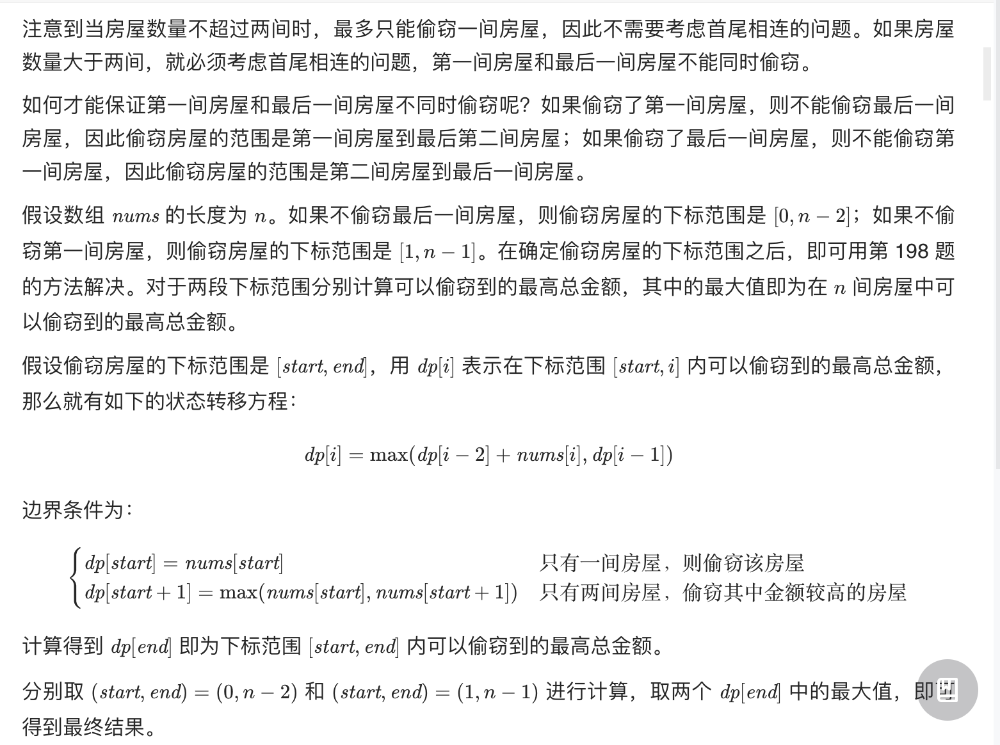

## 题目
你是一个专业的小偷，计划偷窃沿街的房屋，每间房内都藏有一定的现金。这个地方所有的房屋都 围成一圈 ，这意味着第一个房屋和最后一个房屋是紧挨着的。同时，相邻的房屋装有相互连通的防盗系统，如果两间相邻的房屋在同一晚上被小偷闯入，系统会自动报警 。

给定一个代表每个房屋存放金额的非负整数数组，计算你 在不触动警报装置的情况下 ，今晚能够偷窃到的最高金额。

**示例 1**
```
输入：nums = [2,3,2]
输出：3
解释：你不能先偷窃 1 号房屋（金额 = 2），然后偷窃 3 号房屋（金额 = 2）, 因为他们是相邻的。
```

**示例 2**
```
输入：nums = [1,2,3,1]
输出：4
解释：你可以先偷窃 1 号房屋（金额 = 1），然后偷窃 3 号房屋（金额 = 3）。
     偷窃到的最高金额 = 1 + 3 = 4 。
```

**示例 3**
```
输入：nums = [1,2,3]
输出：3
```

## 代码（dp 空间优化）
```Java
class Solution {
    private int[] nums;

    public int rob(int[] nums) {
        int length = nums.length;
        if(length == 1) return nums[0];
        if(length == 2) return Math.max(nums[0], nums[1]);
        this.nums = nums;
        return Math.max(compute(0, nums.length - 1), compute(1, nums.length));
    }

    public int compute(int start, int end) {
        int first = nums[start];
        int second = Math.max(nums[start], nums[start + 1]);
        for(int i = start + 2;i < end;i++){
            int temp = second;
            second = Math.max(second, first + nums[i]);
            first = temp;
        }
        return second;
    }
}
```

## 思路

经典 dp，时间复杂度为 O(n)， 空间复杂度可以进一步优化到 O(1)。

