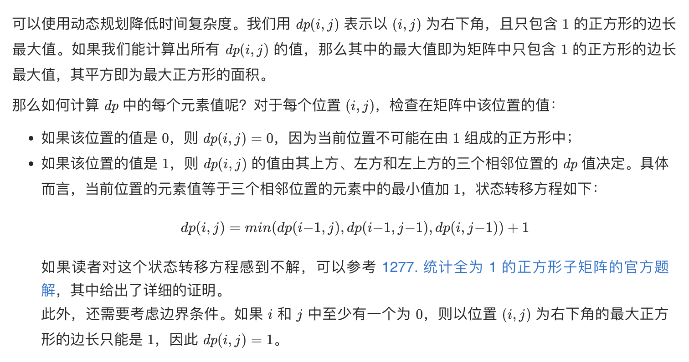

## 题目
在一个由 '0' 和 '1' 组成的二维矩阵内，找到只包含 '1' 的最大正方形，并返回其面积。

**示例 1**
```
输入：matrix = [["1","0","1","0","0"],["1","0","1","1","1"],["1","1","1","1","1"],["1","0","0","1","0"]]
输出：4
```

**示例 2**
```
输入：matrix = [["0","1"],["1","0"]]
输出：1
```

**示例 3**
```
输入：matrix = [["0"]]
输出：0
```

**说明**
* m == matrix.length
* n == matrix[i].length
* 1 <= m, n <= 300
* matrix[i][j] 为 '0' 或 '1'

## 代码
```Java
class Solution {
    public int maximalSquare(char[][] matrix) {
        int m = matrix.length;
        int n = matrix[0].length;
        int[][] count = new int[m][n];
        int result = 0;
        for(int i = 0;i < m;i++){
            for(int j = 0;j < n;j++){
                if(i == 0 || j == 0) {
                    count[i][j] = matrix[i][j] == '1' ? 1 : 0 ;
                } else if (matrix[i][j] == '0') {
                    count[i][j] = 0;
                } else {
                    count[i][j] = Math.min(count[i][j - 1], Math.min(count[i - 1][j], count[i - 1][j - 1])) + 1;
                }
                result = Math.max(result, count[i][j]);
            }
        }
        return result * result;
    }
}
```
## 思路



* 时间复杂度：O(mn)，其中 m 和 n 是矩阵的行数和列数。需要遍历原始矩阵中的每个元素计算 dp 的值。
* 空间复杂度：O(mn)，其中 m 和 n 是矩阵的行数和列数。创建了一个和原始矩阵大小相同的矩阵 dp。由于状态转移方程中的 dp(i,j) 由其上方、左方和左上方的三个相邻位置的 dp 值决定，因此可以使用两个一维数组进行状态转移，空间复杂度优化至 O(n)。