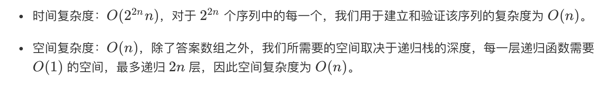
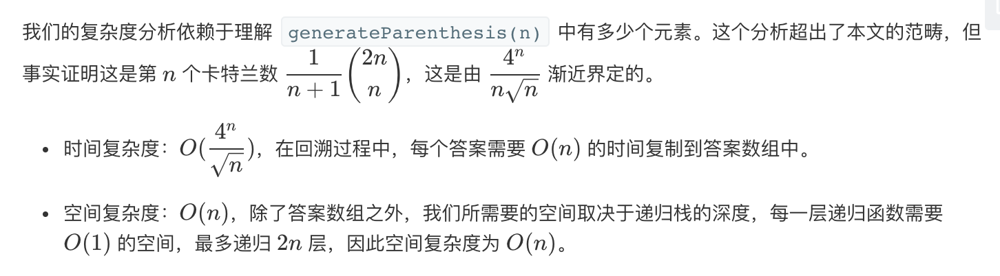

## 题目
数字 n 代表生成括号的对数，请你设计一个函数，用于能够生成所有可能的并且 有效的 括号组合。

**示例 1**
```
输入：n = 3
输出：[
       "((()))",
       "(()())",
       "(())()",
       "()(())",
       "()()()"
     ]
```

## 代码（暴力）
```Java
class Solution {
    private Set<String> set = new HashSet<>();
    private int n;

    public List<String> generateParenthesis(int n) {
        this.n = n;
        dfs(new StringBuilder(2 * n), 0);
        return new ArrayList<>(set);
    }

    public void dfs(StringBuilder sb, int index) {
        if (index == 2 * n){
            String str = sb.toString();
            if(valid(str)){
                set.add(str);
            }
            return;
        }
        sb.append('(');
        dfs(sb, index + 1);
        sb.deleteCharAt(index);
        sb.append(')');
        dfs(sb, index + 1);
        sb.deleteCharAt(index);
    }

    public boolean valid(String str){
        int balance = 0;
        for(int i = 0;i < str.length();i++){
            if(str.charAt(i) == '(') {
                balance++;
            } else {
                balance--;
            }
            if(balance < 0){
                return false;
            }
        }
        return balance == 0;
    }
}
```

## 代码（回溯）
```Java
class Solution {
    private Set<String> set = new HashSet<>();
    private int n;

    public List<String> generateParenthesis(int n) {
        this.n = n;
        dfs(new StringBuilder(2 * n), 0, 0, 0);
        return new ArrayList<>(set);
    }

    public void dfs(StringBuilder sb, int index, int left, int right) {
        if (index == 2 * n){
            String str = sb.toString();
            if(valid(str)){
                set.add(str);
            }
            return;
        }
        if(left < n) {
            sb.append('(');
            dfs(sb, index + 1, left + 1, right);
            sb.deleteCharAt(index);
        }
        if(right < n){
            sb.append(')');
            dfs(sb, index + 1, left, right + 1);
            sb.deleteCharAt(index);
        }
    }

    public boolean valid(String str){
        int balance = 0;
        for(int i = 0;i < str.length();i++){
            if(str.charAt(i) == '(') {
                balance++;
            } else {
                balance--;
            }
            if(balance < 0){
                return false;
            }
        }
        return balance == 0;
    }
}
```

## 思路

更多解法可以参考此 [博客](https://leetcode-cn.com/problems/generate-parentheses/solution/hui-su-suan-fa-by-liweiwei1419/)

### 解法 1
最直接的方法就是暴力生成所有可能的情况再一个个判断。为了生成所有序列，我们可以使用递归。长度为 n 的序列就是在长度为 n-1 的序列前加一个 '(' 或 ')'。为了检查序列是否有效，我们遍历这个序列，并使用一个变量 balance 表示左括号的数量减去右括号的数量。如果在遍历过程中 balance 的值小于零，或者结束时 balance 的值不为零，那么该序列就是无效的，否则它是有效的。


### 解法 2
上个方法还有改进的余地：我们可以只在序列仍然保持有效时才添加 '(' or ')'，而不是像上个方法那样每次添加。我们可以通过跟踪到目前为止放置的左括号和右括号的数目来做到这一点，

如果左括号数量不大于 n，我们可以放一个左括号。如果右括号数量小于左括号的数量，我们可以放一个右括号。

