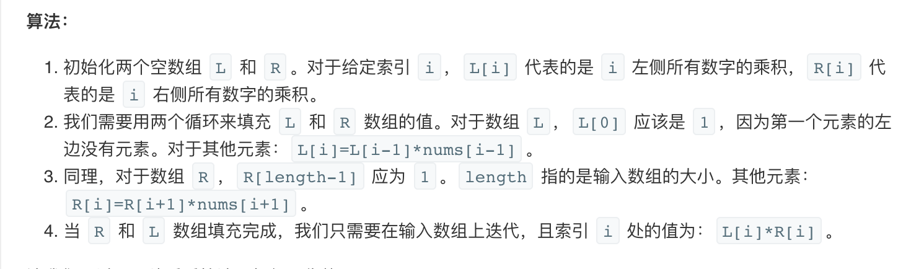

## 题目
给你一个长度为 n 的整数数组 nums，其中 n > 1，返回输出数组 output ，其中 output[i] 等于 nums 中除 nums[i] 之外其余各元素的乘积。

**示例1**
```
输入: [1,2,3,4]
输出: [24,12,8,6]
```

**提示**
* 题目数据保证数组之中任意元素的全部前缀元素和后缀（甚至是整个数组）的乘积都在 32 位整数范围内。

**说明**
* 请不要使用除法，且在 O(n) 时间复杂度内完成此题。

**进阶**
* 你可以在常数空间复杂度内完成这个题目吗？（ 出于对空间复杂度分析的目的，输出数组不被视为额外空间。）

## 代码（左右列表乘积）
```C++
class Solution {
public:
    vector<int> productExceptSelf(vector<int>& nums) {
        int len = nums.size();
        vector<int> L(len);
        vector<int> R(len);
        
        L[0] = 1;
        for(int i = 1;i < len;i++){
            L[i] = L[i - 1] * nums[i - 1]; 
        }
        
        R[len-1] = 1;
        for(int i = len - 2;i >= 0;i--){
            R[i] = R[i + 1] * nums[i + 1];
        }
        
        vector<int> answer(len);
        for(int i = 0;i < len;i++){
            answer[i] = L[i] * R[i];
        }
        return answer;
    }
};
```

## 代码（左右列表乘积优化）
```C++
class Solution {
public:
    vector<int> productExceptSelf(vector<int>& nums) {
        int len = nums.size();
        vector<int> answer(len);
        
        int K = 1;
        for(int i = 0;i < len;i++){
            answer[i] = K;
            K *= nums[i];
        }
        
        K = 1;
        for(int i = len - 1;i >= 0;i--){
            answer[i] *= K;
            K *= nums[i]; 
        }
        
        return answer;
    }
};
```

## 思路

这似乎是一个简单的问题，可以在线性时间和空间内解决。可以先计算给定数组所有元素的乘积，然后对数组中的每个元素 x，将乘积除以 x 来求得除自身值的以外的数组乘积。

然后这样的解决方法有一个问题，就是如果输入数组中出现 0，那么这个方法就失效了。而且在问题中说明了不允许使用除法运算，所以研究出这样的算法还是有意义的。

具体可以参考此[博客](https://leetcode-cn.com/problems/product-of-array-except-self/solution/chu-zi-shen-yi-wai-shu-zu-de-cheng-ji-by-leetcode/)

### 解法1

* 时间复杂度：O(N)，其中 N 指的是输入数组的大小，实际是O(3N)。
* 空间复杂度：O(N)，使用了 L 和 R 数组去构造答案。

### 解法2
实际可以对以上做法有一点小优化，即不用构建L，R数组，直接利用结果数组动态构建。这样时间复杂度也是O(N)，但是不是O(3N)了，少了个常数。官方解答里面实在说这是O(1)因为结果的O(N)不算实在是太狗了。