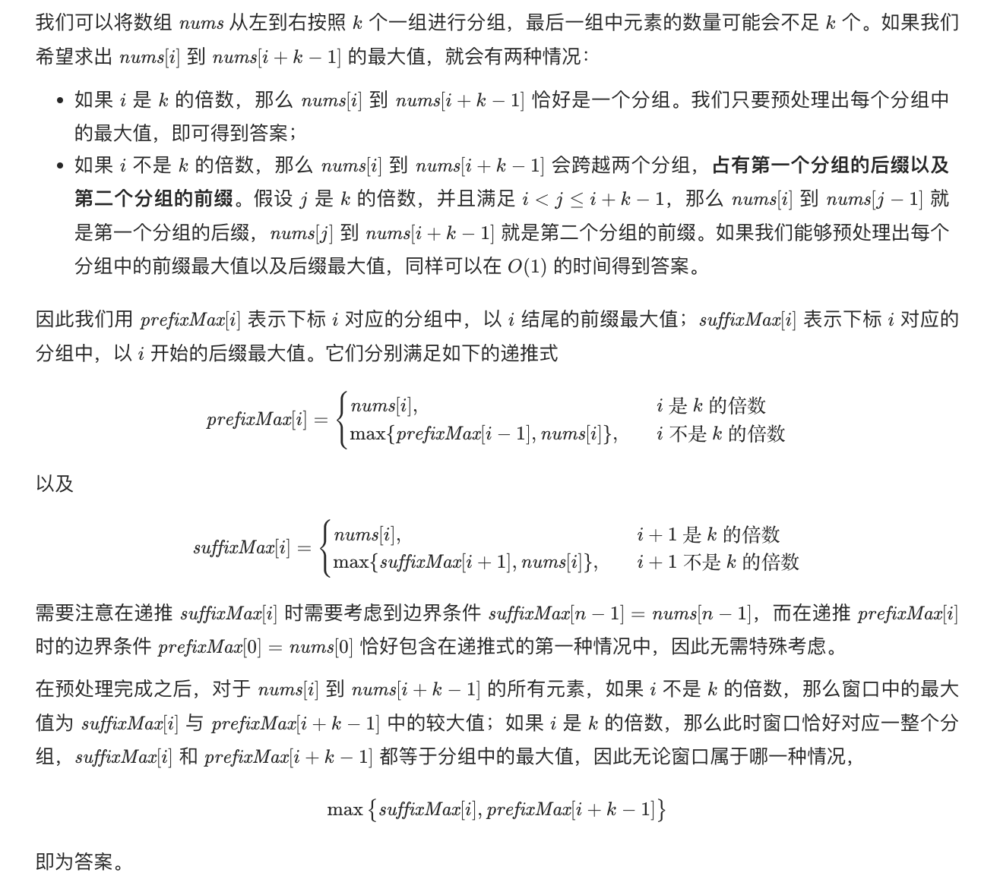

## 题目
给你一个整数数组 nums，有一个大小为 k 的滑动窗口从数组的最左侧移动到数组的最右侧。你只可以看到在滑动窗口内的 k 个数字。滑动窗口每次只向右移动一位。

返回 滑动窗口中的最大值 。

**示例 1**
```
输入：nums = [1,3,-1,-3,5,3,6,7], k = 3
输出：[3,3,5,5,6,7]
解释：
滑动窗口的位置                最大值
---------------               -----
[1  3  -1] -3  5  3  6  7       3
 1 [3  -1  -3] 5  3  6  7       3
 1  3 [-1  -3  5] 3  6  7       5
 1  3  -1 [-3  5  3] 6  7       5
 1  3  -1  -3 [5  3  6] 7       6
 1  3  -1  -3  5 [3  6  7]      7
```

**示例 2**
```
输入：nums = [1], k = 1
输出：[1]
```

**说明**
* 1 <= nums.length <= 10^5
* -10^4 <= nums[i] <= 10^4
* 1 <= k <= nums.length

## 代码（左右列表乘积）
```Java
class Solution {
    public int[] maxSlidingWindow(int[] nums, int k) {
        int len = nums.length;
        int[] suffixMax = new int[len];
        int[] prefixMax = new int[len];
        for(int i = 0;i < len;i++){
            if(i % k == 0) {
                prefixMax[i] = nums[i];
            } else {
                prefixMax[i] = Math.max(prefixMax[i - 1], nums[i]);
            }
        }
        for(int i = len - 1;i >= 0;i--){
            if(i == len - 1 || (i + 1) % k == 0) {
                suffixMax[i] = nums[i];
            } else {
                suffixMax[i] = Math.max(suffixMax[i + 1], nums[i]);
            }
        }
        int[] result = new int[len - k + 1];
        for(int i = 0;i <= len - k;i++) {
            result[i] = Math.max(suffixMax[i], prefixMax[i + k - 1]);
        }
        return result;
    }
}
```

## 思路

采用分块预处理的方式可以达到 O(N) 的时间和空间复杂度。


还可以利用单调队列来做，具体可参考官方 [博客](https://leetcode.cn/problems/sliding-window-maximum/solution/hua-dong-chuang-kou-zui-da-zhi-by-leetco-ki6m/)。