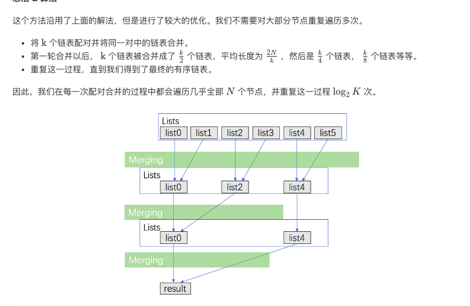

## 题目
合并 k 个排序链表，返回合并后的排序链表。请分析和描述算法的复杂度。

**示例1**
```
输入:
[
  1->4->5,
  1->3->4,
  2->6
]
输出: 1->1->2->3->4->4->5->6
```

## 代码（暴力合并）
```C++
/**
 * Definition for singly-linked list.
 * struct ListNode {
 *     int val;
 *     ListNode *next;
 *     ListNode(int x) : val(x), next(NULL) {}
 * };
 */
class Solution {
public:
    ListNode* mergeKLists(vector<ListNode*>& lists) {
        if(lists.empty()){
            return NULL;
        }
        if(lists.size() == 0){
            return lists[0];
        }
        ListNode* node = lists[0];
        for(int i = 1;i < lists.size();i++){
            node = mergeTwoLists(node,lists[i]);
        }
        return node;
    }
    
    ListNode* mergeTwoLists(ListNode* l1, ListNode* l2) {
        if(l1 == NULL){
            return l2;
        }else if (l2 == NULL){
            return l1;
        }else{
            if(l1->val < l2->val){
                l1->next = mergeTwoLists(l1->next,l2);
                return l1;
            }else{
                l2->next = mergeTwoLists(l1,l2->next);
                return l2;
            }
        }
    }
};
```

## 代码（二分合并）
```C++
/**
 * Definition for singly-linked list.
 * struct ListNode {
 *     int val;
 *     ListNode *next;
 *     ListNode(int x) : val(x), next(NULL) {}
 * };
 */
class Solution {
public:
    ListNode* mergeKLists(vector<ListNode*>& lists) {
        if(lists.empty()){
            return NULL;
        }
        return merge(lists,0,lists.size()-1);
    }
    
    ListNode* merge(vector<ListNode*>& lists,int left,int right){
        if(left == right){
            return lists[left];
        }
        int mid = left + (right - left) / 2;
        ListNode* l1 = merge(lists, left, mid);
        ListNode* l2 = merge(lists, mid+1, right);
        return mergeTwoLists(l1, l2);
    }
    
    ListNode* mergeTwoLists(ListNode* l1, ListNode* l2) {
        if(l1 == NULL){
            return l2;
        }else if (l2 == NULL){
            return l1;
        }else{
            if(l1->val < l2->val){
                l1->next = mergeTwoLists(l1->next,l2);
                return l1;
            }else{
                l2->next = mergeTwoLists(l1,l2->next);
                return l2;
            }
        }
    }
};
```

## 代码（优先队列）
```C++
class Solution {
public:
    struct Status {
        int val;
        ListNode *ptr;
        bool operator < (const Status &rhs) const {
            return val > rhs.val;
        }
    };

    priority_queue <Status> q;

    ListNode* mergeKLists(vector<ListNode*>& lists) {
        for (auto node: lists) {
            if (node) q.push({node->val, node});
        }
        ListNode head, *tail = &head;
        while (!q.empty()) {
            auto f = q.top(); q.pop();
            tail->next = f.ptr; 
            tail = tail->next;
            if (f.ptr->next) q.push({f.ptr->next->val, f.ptr->next});
        }
        return head.next;
    }
};
```

## 思路

具体可参考此[博客](https://leetcode-cn.com/problems/merge-k-sorted-lists/solution/he-bing-kge-pai-xu-lian-biao-by-leetcode-solutio-2/)
### 解法1
涉及到多个链表的合并可以将合并k个链表的问题转化成合并2个链表k-1次。这样时间复杂度是O(k^2 N)，其中k是链表的数目，空间复杂度是O(1)。

### 解法2
也可以使用分而治之的方法，这样时间复杂度是O(Nlgk)，其中k是链表的数目，空间复杂度是O(1)。解析如下：



### 解法3
使用优先队列也是一种做法。