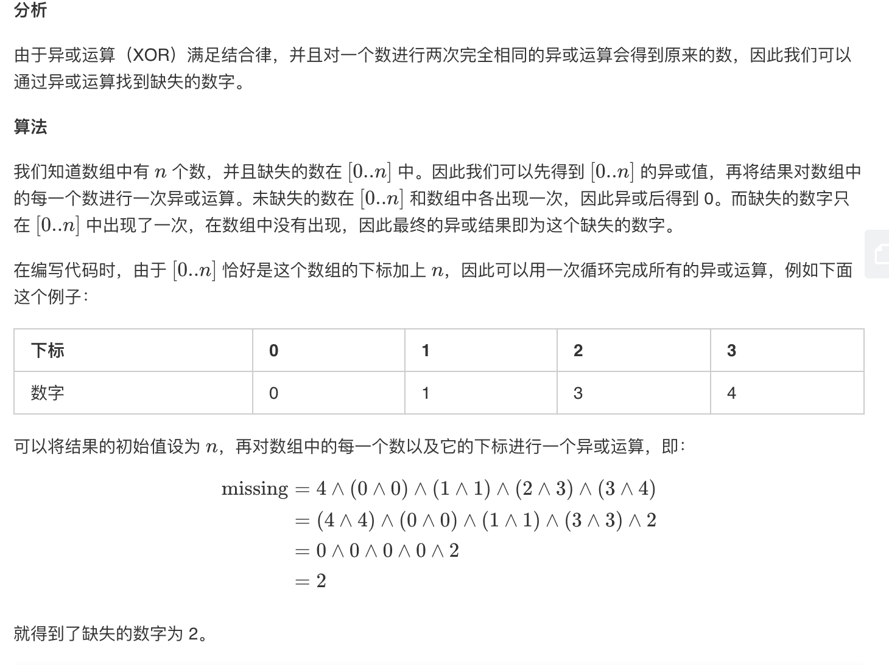

## 题目
给定一个包含 0, 1, 2, ..., n 中 n 个数的序列，找出 0 .. n 中没有出现在序列中的那个数。

**示例1**
```
输入: [3,0,1]
输出: 2
```

**示例2**
```
输入: [9,6,4,2,3,5,7,0,1]
输出: 8
```

**说明**
* 你的算法应具有线性时间复杂度。你能否仅使用额外常数空间来实现?

## 代码
```C++
class Solution {
public:
    int missingNumber(vector<int>& nums) {
        int len = nums.size();
        int missing = len;
        for(int i = 0;i < len;i++){
            missing ^= i^nums[i] ;
        }
        return missing;
    }
};
```


## 思路

以上是我最喜欢的做法，利用了异或的性质。


[这里](https://leetcode-cn.com/problems/missing-number/solution/que-shi-shu-zi-by-leetcode/)还有更多的讨论。