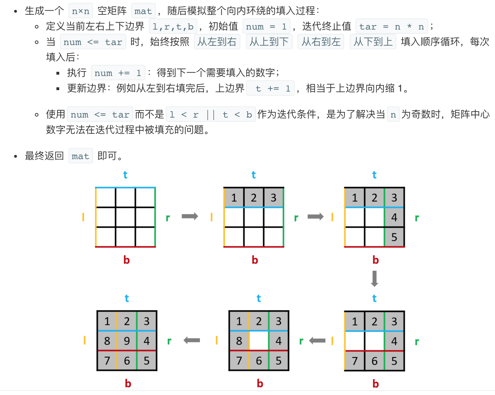

## 题目
给定一个正整数 n，生成一个包含 1 到 n2 所有元素，且元素按顺时针顺序螺旋排列的正方形矩阵。

**示例1**
```
输入: 3
输出:
[
 [ 1, 2, 3 ],
 [ 8, 9, 4 ],
 [ 7, 6, 5 ]
]
```

## 代码
```C++
class Solution {
public:
    vector<vector<int>> generateMatrix(int n) {
        vector<vector<int>> matrix(n,vector<int>(n,0));
        int up = 0;
        int down = n - 1;
        int left = 0;
        int right = n - 1;
        int k = 1;
        while(true){
            for(int i = left;i <= right;i++) matrix[up][i] = k++;
            if(++up > down) break;
            for(int i = up;i <= down;i++) matrix[i][right] = k++;
            if(--right < left) break;
            for(int i = right;i >= left;i--) matrix[down][i] = k++;
            if(--down < up) break;
            for(int i = down;i >= up;i--) matrix[i][left] = k++;
            if(++left > right) break;
        }
        return matrix;
    }
};
```


## 思路

模拟出四个边界去遍历即可。
