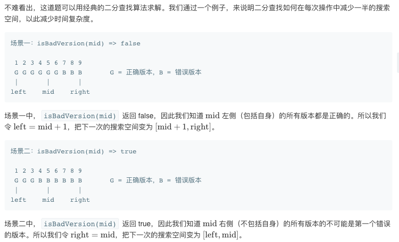
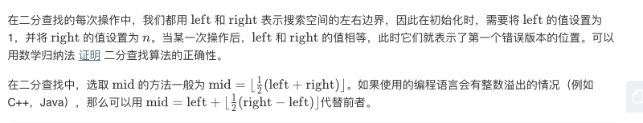

## 题目
你是产品经理，目前正在带领一个团队开发新的产品。不幸的是，你的产品的最新版本没有通过质量检测。由于每个版本都是基于之前的版本开发的，所以错误的版本之后的所有版本都是错的。

假设你有 n 个版本 [1, 2, ..., n]，你想找出导致之后所有版本出错的第一个错误的版本。

你可以通过调用 bool isBadVersion(version) 接口来判断版本号 version 是否在单元测试中出错。实现一个函数来查找第一个错误的版本。你应该尽量减少对调用 API 的次数。

**示例1**
```
给定 n = 5，并且 version = 4 是第一个错误的版本。

调用 isBadVersion(3) -> false
调用 isBadVersion(5) -> true
调用 isBadVersion(4) -> true

所以，4 是第一个错误的版本。 
```

## 代码
```C++
// Forward declaration of isBadVersion API.
bool isBadVersion(int version);

class Solution {
public:
    int firstBadVersion(int n) {
        long long int left = 1;
        long long int right = n;
        while(left < right){
            int mid = (left + right) >> 1;
            if(isBadVersion(mid)) right = mid;
            else left = mid + 1;
        }
        return right;
    }
};
```


## 思路
这种二分需要对每次迭代的上界和下界做一个正确分析。


