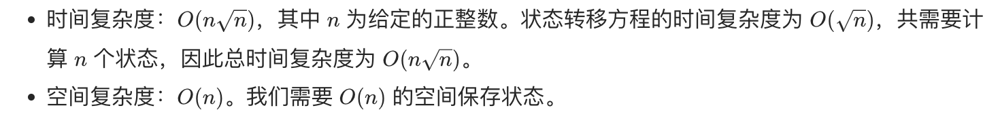

## 题目
给定正整数 n，找到若干个完全平方数（比如 1, 4, 9, 16, ...）使得它们的和等于 n。你需要让组成和的完全平方数的个数最少。

**示例 1**
```
输入：n = 12
输出：3 
解释：12 = 4 + 4 + 4.
```

**示例 2**
```
输入：n = 13
输出：2
解释：13 = 4 + 9.
```

## 代码（dp）
```JAVA
class Solution {
    public int numSquares(int n) {
        int[] dp = new int[n + 1];
        for(int i = 1;i <= n;i++){
            dp[i] = Integer.MAX_VALUE;
            for(int j = 1;j * j <= i;j++){
                dp[i] = Math.min(dp[i], dp[i - j * j] + 1);
            }
        }
        return dp[n];
    }
}
```

## 代码 (BFS)
```JAVA
class Solution {
    public int numSquares(int n) {
        Queue<Integer> q = new LinkedList<>();
        q.offer(n);
        int step = 0;
        while(!q.isEmpty()){
            step++;
            int size = q.size();
            for(int i = 0;i < size;i++){
                Integer num = q.poll();
                for(int j = (int)Math.sqrt(num);j >= 1;j--){
                    if(j * j == num){
                        return step;
                    } else {
                        q.offer(num - j * j);
                    }
                }
            }
        }
        return -1;
    }
}
```

## 思路

### 解法 1
这题可以用 dp 做，注意到：对一个数字 n 而言，组成的它的完全平方数的最少个数可以根据它减去`j*j`（这里 `j*j<n`) 后对应的那个数的最少完全平方数加一，通过改变 j 的值最终取得最小值。



### 解法 2
这题也可以通过 bfs 来做。根据 [四平方和定理](https://baike.baidu.com/item/%E5%9B%9B%E5%B9%B3%E6%96%B9%E5%92%8C%E5%AE%9A%E7%90%86)。任意一个正整数都可以被表示为至多四个正整数的平方和。对于只需要一两步就能求出来结果的数字，bfs 的方式会更快。