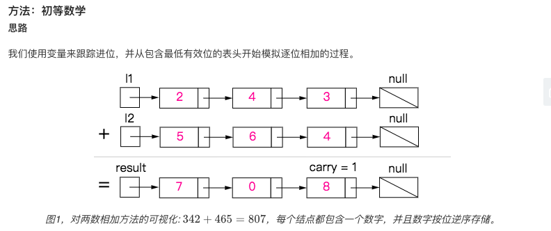
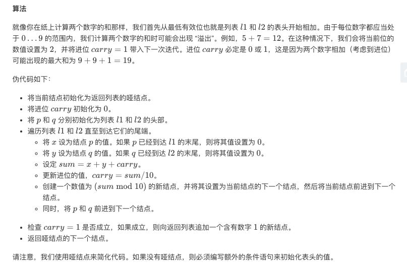
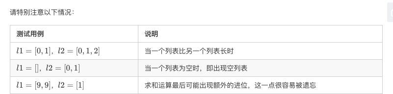
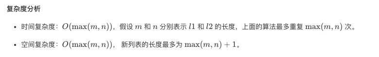

## 题目
给出两个 非空 的链表用来表示两个非负的整数。其中，它们各自的位数是按照 逆序 的方式存储的，并且它们的每个节点只能存储 一位 数字。

如果，我们将这两个数相加起来，则会返回一个新的链表来表示它们的和。

您可以假设除了数字 0 之外，这两个数都不会以 0 开头。

**示例 1**
```
输入：(2 -> 4 -> 3) + (5 -> 6 -> 4)
输出：7 -> 0 -> 8
原因：342 + 465 = 807
```

## 代码
```JAVA
/**
 * Definition for singly-linked list.
 * public class ListNode {
 *     int val;
 *     ListNode next;
 *     ListNode() {}
 *     ListNode(int val) { this.val = val; }
 *     ListNode(int val, ListNode next) { this.val = val; this.next = next; }
 * }
 */
class Solution {
    public ListNode addTwoNumbers(ListNode l1, ListNode l2) {
        ListNode newHead = new ListNode();
        ListNode current = newHead;
        int carry = 0;
        while(l1 != null || l2 != null){
            carry += l1 == null ? 0 : l1.val;
            carry += l2 == null ? 0 : l2.val;
            current.next = new ListNode(carry % 10);
            current = current.next;
            carry = carry / 10;
            l1 = l1 == null ? null : l1.next;
            l2 = l2 == null ? null : l2.next;
        }
        if(carry > 0){
            current.next = new ListNode(carry);
        }
        return newHead.next;
    }
}
```
## 思路
简单说就是利用一个 carry 累加不断更新迭代链表，这道题尤其需要注意边界情况。考虑得清楚代码就很优雅，要不然一堆 if。




