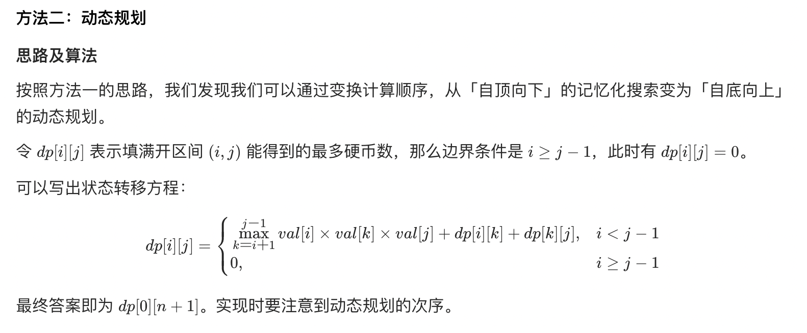
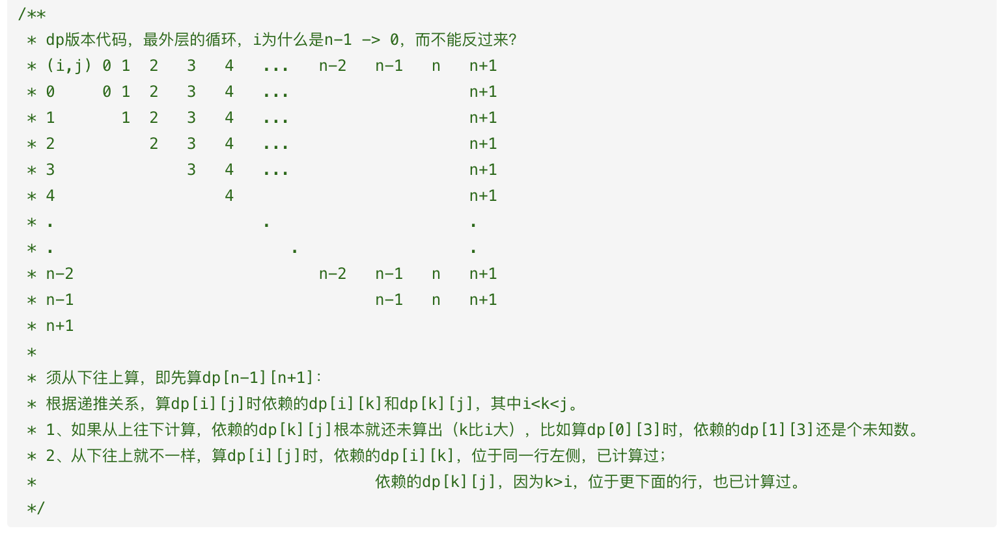

## 题目
有 n 个气球，编号为 0 到 n - 1，每个气球上都标有一个数字，这些数字存在数组 nums 中。

现在要求你戳破所有的气球。戳破第 i 个气球，你可以获得 nums[i - 1] * nums[i] * nums[i + 1] 枚硬币。 这里的 i - 1 和 i + 1 代表和 i 相邻的两个气球的序号。如果 i - 1 或 i + 1 超出了数组的边界，那么就当它是一个数字为 1 的气球。

求所能获得硬币的最大数量。

**示例 1**
```
输入：nums = [3,1,5,8]
输出：167
解释：
nums = [3,1,5,8] --> [3,5,8] --> [3,8] --> [8] --> []
coins =  3*1*5    +   3*5*8   +  1*3*8  + 1*8*1 = 167
```

**示例 2**
```
输入：nums = [1,5]
输出：10
```

**提示**
* n == nums.length
* 1 <= n <= 300
* 0 <= nums[i] <= 100

## 代码
```Java
class Solution {
    public int maxCoins(int[] nums) {
        int n = nums.length;
        int[] values = new int[n + 2];
        values[0] = 1;
        values[n + 1] = 1;
        for(int i = 1;i <= n;i++){
            values[i] = nums[i - 1];
        }
        int[][] dp = new int[n + 2][n + 2];
        for(int i = n - 1;i >= 0;i--) {
            for(int j = i + 2;j <= n + 1;j++){
                for(int k = i + 1;k < j;k++){
                    int sum = values[i] * values[k] * values[j];
                    dp[i][j] = Math.max(dp[i][j], sum + dp[i][k] + dp[k][j]);
                }
            }
        }
        return dp[0][n + 1];
    }
}
```

## 思路

dp 即可，关键在于反过来推导计算，特别需要注意计算顺序。具体可参考 [官方博客](https://leetcode.cn/problems/burst-balloons/solution/chuo-qi-qiu-by-leetcode-solution/)。




时间复杂度 O(N^3)，空间复杂度 O(N^2)。