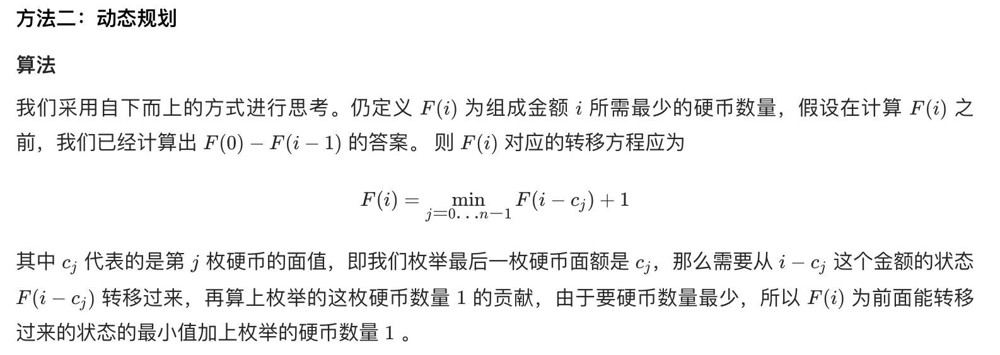

## 题目
给你一个整数数组 coins ，表示不同面额的硬币；以及一个整数 amount ，表示总金额。

计算并返回可以凑成总金额所需的 最少的硬币个数 。如果没有任何一种硬币组合能组成总金额，返回 -1 。

你可以认为每种硬币的数量是无限的。

**示例 1**
```
输入：coins = [1, 2, 5], amount = 11
输出：3 
解释：11 = 5 + 5 + 1
```

**示例 2**
```
输入：coins = [2], amount = 3
输出：-1
```

**示例 3**
```
输入：coins = [1], amount = 0
输出：0
```

**说明**
* 1 <= coins.length <= 12
* 1 <= coins[i] <= 2^31 - 1
* 0 <= amount <= 10^4

## 代码
```Java
class Solution {
    public int coinChange(int[] coins, int amount) {
        int[] dp = new int[amount + 1];
        Arrays.fill(dp, amount + 1);
        dp[0] = 0;
        for(int i = 1;i <= amount;i++) {
            for(int coin : coins) {
                if(coin <= i) {
                    dp[i] = Math.min(dp[i], dp[i - coin] + 1);
                }
            }
        }
        return dp[amount] > amount ? -1 : dp[amount]; 
    }
}
```

## 思路



* 时间复杂度：O(Sn)，其中 S 是金额，n 是面额数。我们一共需要计算 O(S) 个状态，S 为题目所给的总金额。对于每个状态，每次需要枚举 n 个面额来转移状态，所以一共需要 O(Sn) 的时间复杂度。
* 空间复杂度：O(S)。数组 dp 需要开长度为总金额 S 的空间。
