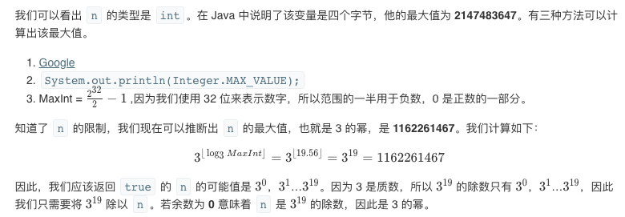

## 题目
给定一个整数，写一个函数来判断它是否是 3 的幂次方

**示例1**
```
输入: 27
输出: true
```

**示例2**
```
输入: 0
输出: false
```

**示例3**
```
输入: 9
输出: true
```

**示例4**
```
输入: 45
输出: false
```

## 代码(从下往上暴力)
```C++
class Solution {
public:
    bool isPowerOfThree(int n) {
        long long int sum = 1;
        while(sum <= n){
            if (sum == n){
                return true;
            }
            sum *= 3;
        }
        return false;
    }
};
```

## 代码(从上往下暴力)
```C++
class Solution {
public:
    bool isPowerOfThree(int n) {
       if (n < 1) {
            return false;
        }
        while (n % 3 == 0) {
            n /= 3;
        }
        return n == 1;
    }
};
```

## 思路

### 解法1
最直接的方法就是使用循环计算的方式，时间复杂度是O(lgn),空间复杂度是O(1)。


### 解法2
可以使用计算机体系结构的知识，时间和空间复杂度都成了O(1)。
