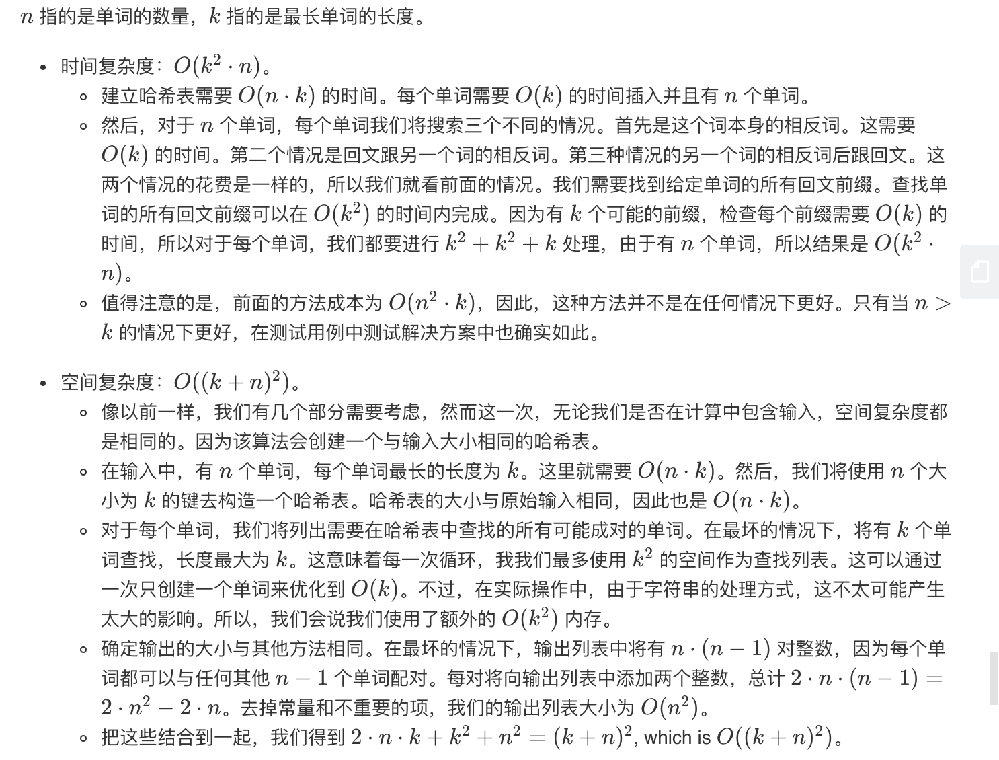

## 题目
给定一组唯一的单词， 找出所有不同 的索引对`(i, j)`，使得列表中的两个单词， `words[i] + words[j]` ，可拼接成回文串。

**示例1**
```
输入: ["abcd","dcba","lls","s","sssll"]
输出: [[0,1],[1,0],[3,2],[2,4]] 
解释: 可拼接成的回文串为 ["dcbaabcd","abcddcba","slls","llssssll"]
```

**示例2**
```
输入: ["bat","tab","cat"]
输出: [[0,1],[1,0]] 
解释: 可拼接成的回文串为 ["battab","tabbat"]
```

## 代码
```C++
class Solution {
public:
    bool isPalindrome(string& word)
    {
        int left = 0;
        int right = word.size() - 1;
        while (left < right) {
            if (word[left] != word[right]) {
                return false;
            }
            left++;
            right--;
        }
        return true;
    }

    string reverseStr(string& s, int start, int len)
    {
        string revs = s.substr(start, len);
        reverse(revs.begin(), revs.end());
        return revs;
    }

    vector<vector<int>> palindromePairs(vector<string>& words) {
        map<string, vector<int>> dictlist;
        vector<vector<int>> ans;

        if (words.size() < 2) return ans;
        for (int i = 0; i < words.size(); i++) {
            dictlist[words[i]].push_back(i);
        }
        for (int i = 0; i < words.size(); i++) {
            string word = words[i];
            if (word == "") {
                continue;
            }
            // 1、字符串本身回文检查
            if (isPalindrome(word)) {
                for (auto index : dictlist[""]) {
                    ans.push_back({i, index});
                    ans.push_back({index, i});
                }
            }
            // 2、字符串翻转检查
            string revs = reverseStr(word, 0, word.size());
            if (revs != word) {
                for (auto index : dictlist[revs]) {
                    ans.push_back({i, index});
                }
            }
            // 3、字符产拆分，前半部分是回文，后半部分检查列表
            for (int k = 1; k < word.size(); k++) {
                string pre = word.substr(0, k);
                string backrev = reverseStr(word, k, word.size());
                if (isPalindrome(pre) && dictlist.count(backrev)) {
                    for (auto index : dictlist[backrev]) {
                        ans.push_back({index, i});
                    }
                }
            }
            // 4、字符产拆分，后半部分是回文，前半部分检查列表
            for (int k = 1; k < word.size(); k++) {
                string back = word.substr(k);
                string prerev = reverseStr(word, 0, k);
                if (isPalindrome(back) && dictlist.count(prerev)) {
                    for (auto index : dictlist[prerev]) {
                        ans.push_back({i, index});
                    }
                }
            }
        }
        return ans;
    }
};
```
## 思路

不考虑暴力算法的话，需要仔细想想场景：
1. 字符串本身是回文，并且列表中存在空串，该字符串与每一个空串形成两组结果
2. 字符串本身不是回文，翻转后的字符串在表中存在，每个形成两组结果(由于会遍历解，只需要存储当前的)，由于是唯一字符串，所以不存在重复的结果
3. 字符串拆分，前半部分是回文，后半部分翻转后在列表中存在，形成一组回文，注意顺序
4. 字符串拆分，后半部分是回文，前半部分翻转后再列表中存在，形成一组回文，注意顺序
5. 数据存储结构 `map<string, vector<int>>`


