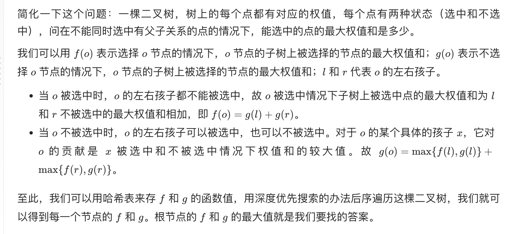

## 题目
小偷又发现了一个新的可行窃的地区。这个地区只有一个入口，我们称之为 root 。

除了 root 之外，每栋房子有且只有一个“父“房子与之相连。一番侦察之后，聪明的小偷意识到“这个地方的所有房屋的排列类似于一棵二叉树”。 如果 两个直接相连的房子在同一天晚上被打劫 ，房屋将自动报警。

给定二叉树的 root 。返回 在不触动警报的情况下 ，小偷能够盗取的最高金额 。

**示例 1**
```
输入：root = [3,2,3,null,3,null,1]
输出：7 
解释：小偷一晚能够盗取的最高金额 3 + 3 + 1 = 7
```

**示例 2**
```
输入：root = [3,4,5,1,3,null,1]
输出：9
解释：小偷一晚能够盗取的最高金额 4 + 5 = 9
```

## 代码（树形 dp）
```Java
/**
 * Definition for a binary tree node.
 * public class TreeNode {
 *     int val;
 *     TreeNode left;
 *     TreeNode right;
 *     TreeNode() {}
 *     TreeNode(int val) { this.val = val; }
 *     TreeNode(int val, TreeNode left, TreeNode right) {
 *         this.val = val;
 *         this.left = left;
 *         this.right = right;
 *     }
 * }
 */
class Solution {
    private Map<TreeNode, Integer> counts = new HashMap<>();

    public int rob(TreeNode root) {
        dfs(root);
        return counts.get(root);
    }

    public void dfs(TreeNode root) {
        if(root != null){
            dfs(root.left);
            dfs(root.right);
            if(root.left == null && root.right == null) {
                counts.put(root, root.val);
            } else {
                int curVal = root.val;
                int childVal = 0;
                if(root.left != null){
                    childVal += counts.get(root.left);
                    if(root.left.left != null){
                        curVal += counts.get(root.left.left);
                    }
                    if(root.left.right != null){
                        curVal += counts.get(root.left.right);
                    }
                }
                if(root.right != null) {
                    childVal += counts.get(root.right);
                    if(root.right.left != null){
                        curVal += counts.get(root.right.left);
                    }
                    if(root.right.right != null){
                        curVal += counts.get(root.right.right);
                    }
                }
                counts.put(root, Math.max(curVal, childVal));
            }
        }
    }
}
```

## 代码（树形 dp 代码优化）
```Java
/**
 * Definition for a binary tree node.
 * public class TreeNode {
 *     int val;
 *     TreeNode left;
 *     TreeNode right;
 *     TreeNode() {}
 *     TreeNode(int val) { this.val = val; }
 *     TreeNode(int val, TreeNode left, TreeNode right) {
 *         this.val = val;
 *         this.left = left;
 *         this.right = right;
 *     }
 * }
 */
class Solution {
    private Map<TreeNode, Integer> selected = new HashMap<>();
    private Map<TreeNode, Integer> unSelected = new HashMap<>();

    public int rob(TreeNode root) {
        dfs(root);
        return Math.max(selected.getOrDefault(root, 0), unSelected.getOrDefault(root, 0));
    }

    public void dfs(TreeNode root) {
        if(root != null){
            dfs(root.left);
            dfs(root.right);
            selected.put(root, root.val + unSelected.getOrDefault(root.left, 0) + unSelected.getOrDefault(root.right, 0));
            unSelected.put(root, Math.max(selected.getOrDefault(root.left, 0), unSelected.getOrDefault(root.left, 0)) + Math.max(selected.getOrDefault(root.right, 0), unSelected.getOrDefault(root.right, 0)));
        }
    }
}
```

## 代码（树形 dp 空间优化）
```Java
/**
 * Definition for a binary tree node.
 * public class TreeNode {
 *     int val;
 *     TreeNode left;
 *     TreeNode right;
 *     TreeNode() {}
 *     TreeNode(int val) { this.val = val; }
 *     TreeNode(int val, TreeNode left, TreeNode right) {
 *         this.val = val;
 *         this.left = left;
 *         this.right = right;
 *     }
 * }
 */
class Solution {

    public int rob(TreeNode root) {
        int[] result = dfs(root);
        return Math.max(result[0], result[1]);
    }

    public int[] dfs(TreeNode root) {
        if(root == null) return new int[]{0 , 0};
        int[] left = dfs(root.left);
        int[] right = dfs(root.right);
        int leftResult = root.val + left[1] + right[1];
        int rightResult = Math.max(left[0], left[1]) + Math.max(right[0], right[1]);
        return new int[]{leftResult, rightResult};
    }
}
```

## 思路

### 解法 1
经典树形 dp，后续遍历从最小树的情况逐步推断即可。时间空间复杂度均为 O(n)。

### 解法 2

可以采用更清晰的代码来 AC。时间空间复杂度均为 O(n)。


### 解法 3

空间上由于只依赖子节点，所以可以去除哈希表减少空间占用，但空间复杂度仍然为 O(n)。
