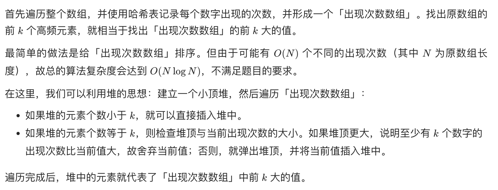
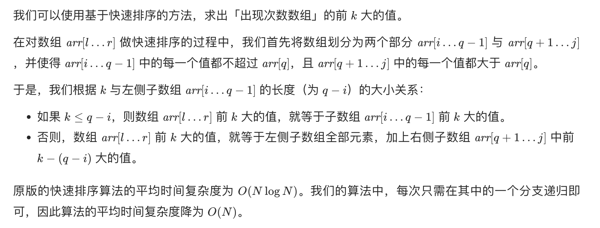

## 题目
给定一个非空的整数数组，返回其中出现频率前 k 高的元素。

**示例 1**
```
输入：nums = [1,1,1,2,2,3], k = 2
输出：[1,2]
```

**示例 2**
```
输入：nums = [1], k = 1
输出：[1]
```

**说明**
* 1 <= nums.length <= 10^5
* k 的取值范围是 [1, 数组中不相同的元素的个数]
* 题目数据保证答案唯一，换句话说，数组中前 k 个高频元素的集合是唯一的

## 代码（优先队列）
```Java
class Solution {
    public int[] topKFrequent(int[] nums, int k) {
        Map<Integer, Integer> occurs = new HashMap<>();
        for(int num : nums) {
            occurs.put(num, occurs.getOrDefault(num, 0) + 1);
        }
        PriorityQueue<int[]> q = new PriorityQueue<>((o1, o2) -> o1[1] - o2[1]);
        for(Map.Entry<Integer, Integer> entry : occurs.entrySet()) {
            int num = entry.getKey();
            int count = entry.getValue();
            if(q.size() < k) {
                q.offer(new int[]{num, count});
            } else if (q.peek()[1] < count) {
                q.poll();
                q.offer(new int[]{num, count});
            }
        }
        int[] result = new int[k];
        for(int i = 0;i < k;i++) {
            result[i] = q.poll()[0];
        }
        return result;
    }
}
```

## 代码（快排）
```Java
class Solution {

    Random r = new Random(System.currentTimeMillis());

    public int[] topKFrequent(int[] nums, int k) {
        Map<Integer, Integer> occurs = new HashMap<>();
        for (int num : nums) {
            occurs.put(num, occurs.getOrDefault(num, 0) + 1);
        }
        List<int[]> counts = new ArrayList<>(occurs.size());
        for (Map.Entry<Integer, Integer> entry : occurs.entrySet()) {
            counts.add(new int[]{entry.getKey(), entry.getValue()});
        }
        int[] result = new int[k];
        fillKLargest(counts, 0, counts.size() - 1, result, 0, counts.size() - k);
        return result;
    }

    private void fillKLargest(List<int[]> counts, int left, int right, int[] result, int resultIndex, int k) {
        int index = RandomPartition(counts, left, right);
        if (index < k) {
            fillKLargest(counts, index + 1, right, result, resultIndex, k);
        } else {
            for (int i = index; i <= right; i++) {
                result[resultIndex++] = counts.get(i)[0];
            }
            if (index != k) {
                fillKLargest(counts, left, index - 1, result, resultIndex, k);
            }
        }
    }

    private int RandomPartition(List<int[]> nums, int start, int end) {
        int index = getRandomIndex(start, end);
        swap(nums, start, index);
        return Partition(nums, start, end);
    }

    private int getRandomIndex(int start, int end) {
        return start + r.nextInt(end - start + 1);
    }

    private int Partition(List<int[]> nums, int start, int end) {
        int[] pivot = nums.get(start);
        int left = start;
        int right = end;
        while(left < right) {
            while(left < right && nums.get(right)[1] > pivot[1]) {
                right--;
            }
            if(left < right) {
                nums.set(left, nums.get(right));
            }
            while(left < right && nums.get(left)[1] <= pivot[1]) {
                left++;
            }
            if(left < right) {
                nums.set(right, nums.get(left));
            }
        }
        nums.set(left, pivot);
        return left;
    }

    private void swap(List<int[]> nums, int left, int right) {
        int[] tmp = nums.get(left);
        nums.set(left, nums.get(right));
        nums.set(right, tmp);
    }
}
```

## 思路

### 解法 1



* 时间复杂度：O(Nlogk)，其中 N 为数组的长度。我们首先遍历原数组，并使用哈希表记录出现次数，每个元素需要 O(1) 的时间，共需 O(N) 的时间。随后，我们遍历「出现次数数组」，由于堆的大小至多为 k，因此每次堆操作需要 O(logk) 的时间，共需 O(Nlogk) 的时间。二者之和为 O(Nlogk)。
* 空间复杂度：O(N)。哈希表的大小为 O(N)，而堆的大小为 O(k)，共计为 O(N)。

### 解法 2



* 时间复杂度：O(N^2)，其中 N 为数组的长度。最坏情况下，每次取的中枢数组的元素都位于数组的两端，时间复杂度退化为 O(N^2)。但由于我们在每次递归的开始会先随机选取中枢元素，故出现最坏情况的概率很低。平均情况下，时间复杂度为 O(N)。
* 空间复杂度：O(N)。哈希表的大小为 O(N)，用于排序的数组的大小也为 O(N)，快速排序的空间复杂度最好情况为 O(logN)，最坏情况为 O(N)。
