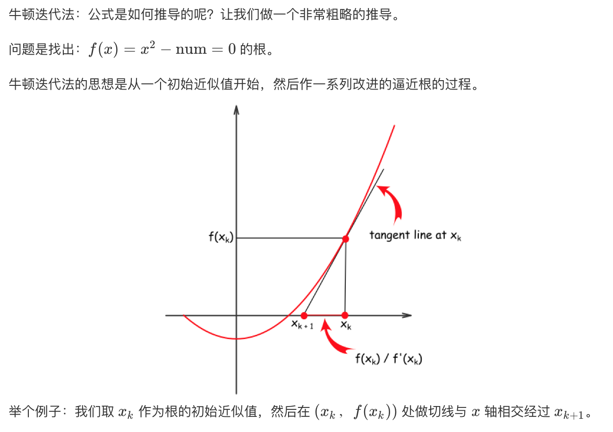
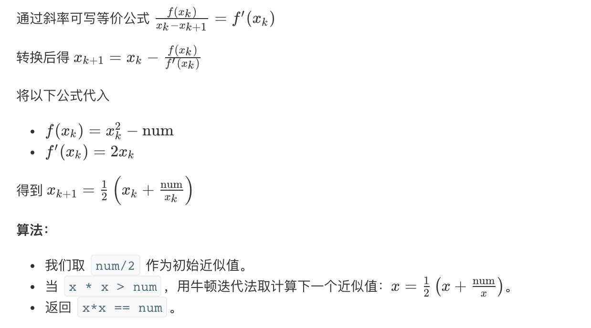

## 题目
给定一个正整数 num，编写一个函数，如果 num 是一个完全平方数，则返回 True，否则返回 False。

说明：不要使用任何内置的库函数，如  sqrt。

**示例1**
```
输入：16
输出：True
```

**示例2**
```
输入：14
输出：False
```

## 代码（二分法）
```Java
class Solution {
    public boolean isPerfectSquare(int num) {
        int left = 0;
        int right = num / 2 + 1;
        while(left <= right){
            int mid = left + (right - left) / 2;
            long res = (long)mid * mid;
            if(res == num){
                return true;
            } else if(res < num){
                left = mid + 1;
            } else if (res > num){
                right = mid - 1;
            }
        }
        return false;
    }
}
```

## 代码（牛顿法）
```Java
class Solution {
    public boolean isPerfectSquare(int num) {
        long current = num / 2 + 1;
        while (current * current > num){
            current = (current + num / current) / 2;
        }
        return current * current == num;
    }
}
```

## 思路

### 解法1
最简单的二分查找法。需要注意开始时最左边为 0，最右边为 num / 2 + 1，为什么右边不是 num 呢？其实这是一个小优化，对于正整数，`(num / 2 + 1) ^ 2 >= num`，所有右边界的初始值不用取那么大。

### 解法2


类似上个解法，初始值取 num / 2 + 1 即可不用特判。