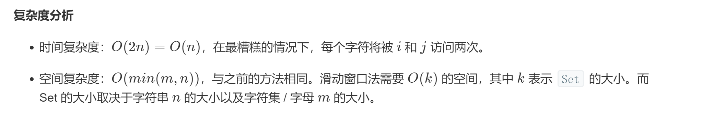
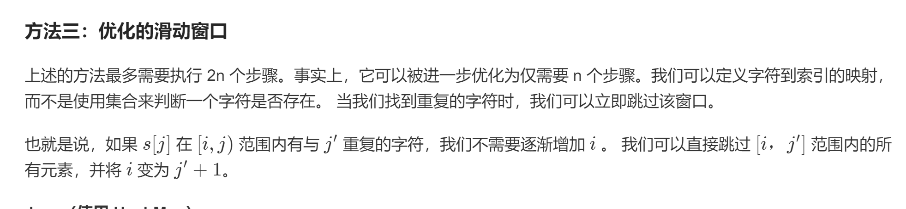

## 题目
给定一个字符串，请你找出其中不含有重复字符的 最长子串 的长度。

**示例1**
```
输入: "abcabcbb"
输出: 3 
解释: 因为无重复字符的最长子串是 "abc"，所以其长度为 3。
```

**示例2**
```
输入: "bbbbb"
输出: 1
解释: 因为无重复字符的最长子串是 "b"，所以其长度为 1。
```

**示例3**
```
输入: "pwwkew"
输出: 3
解释: 因为无重复字符的最长子串是 "wke"，所以其长度为 3。
     请注意，你的答案必须是 子串 的长度，"pwke" 是一个子序列，不是子串。
```

## 代码（暴力）
```C++
class Solution {
public:
    int lengthOfLongestSubstring(string s) {
        int len = s.size();
        if (len == 0){
            return 0;
        }
        int max = 0;
        for(int i = 0;i < len - max;i++){
            unordered_set<char> set;
            bool find = false;
            for(int j = i;j < len;j++){
                if(set.find(s[j]) != set.end()){
                    if(j - i > max){
                        max = j - i;
                    }
                    find = true;
                    break;
                }
                set.insert(s[j]);
            }
            if(!find && len - i > max){
                max = len - i;
            }
        }
        return max;
    }
};
```

## 代码（滑动窗口）
```C++
class Solution {
public:
    int lengthOfLongestSubstring(string s) {
        int len = s.size();
        if (len == 0){
            return 0;
        }
        int max = 0;
        unordered_set<char> set;
        int i = 0;
        int j = 0;
        while(i < len && j < len){
            if(set.find(s[j]) != set.end()){
                set.erase(s[i++]);
            }else{
                set.insert(s[j++]);
                if(j - i > max){
                    max = j - i;
                }
            }
        }
        return max;
    }
};
```

## 代码（优化滑动窗口）
```C++
class Solution {
public:
    int lengthOfLongestSubstring(string s) {
        int len = s.size();
        int max = 0;
        unordered_map<char,int> map;
        for(int i = 0,j = 0;j < len; j++){
            if(map.find(s[j]) != map.end()){
                if (map[s[j]] > i){
                    i = map[s[j]];
                }
            }
            map[s[j]] = j + 1;
            if(j - i + 1 > max){
                max = j - i + 1;
            }
        }
        return max;
    }
};
```


## 思路

这题最直接的做法就是写个双重for循环，然后每次在内部循环的时候搞一个哈希表，遍历判断是否是最长子串，同时记得处理下边界问题，但是这样复杂度太高了，虽然通过了，但是时间排序太靠后了。

看了下其他人有比较高效的做法

做法2



做法3



