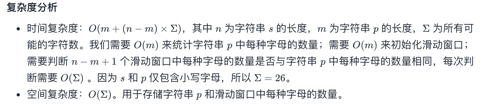
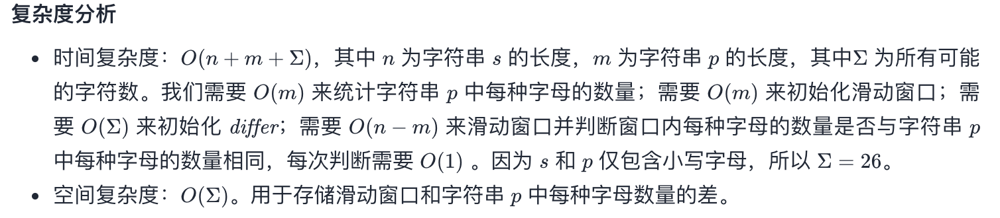

## 题目
给定两个字符串 s 和 p，找到 s 中所有 p 的 异位词 的子串，返回这些子串的起始索引。不考虑答案输出的顺序。

异位词 指由相同字母重排列形成的字符串（包括相同的字符串）。

**示例 1**
```
输入：s = "cbaebabacd", p = "abc"
输出：[0,6]
解释：
起始索引等于 0 的子串是 "cba", 它是 "abc" 的异位词。
起始索引等于 6 的子串是 "bac", 它是 "abc" 的异位词。
```

**示例 2**
```
输入：s = "abab", p = "ab"
输出：[0,1,2]
解释：
起始索引等于 0 的子串是 "ab", 它是 "ab" 的异位词。
起始索引等于 1 的子串是 "ba", 它是 "ab" 的异位词。
起始索引等于 2 的子串是 "ab", 它是 "ab" 的异位词。
```

**提示**
* 1 <= s.length, p.length <= 3 * 10^4
* s 和 p 仅包含小写字母

## 代码
```Java
class Solution {
    public List<Integer> findAnagrams(String s, String p) {
        if (s.length() < p.length()){
            return Collections.emptyList();
        }
        char[] schar = s.toCharArray();
        char[] pchar = p.toCharArray();
        int[] stable = new int[26];
        int[] ptable = new int[26];
        for(char c : pchar){
            ptable[c - 'a']++;
        }
        List<Integer> result = new ArrayList<>();
        for(int i = 0;i < schar.length;i++){
            stable[schar[i] - 'a']++;
            if (i >= pchar.length - 1){
                if (Arrays.equals(stable, ptable)){
                    result.add(i - pchar.length + 1);
                }
                stable[schar[i - pchar.length + 1] - 'a']--;
            }
        }
        return result;
    }
}
```

## 代码
```Java
class Solution {
    public List<Integer> findAnagrams(String s, String p) {
        if (s.length() < p.length()){
            return Collections.emptyList();
        }
        int[] table = new int[26];
        for(char c : p.toCharArray()){
            table[c - 'a']++;
        }
        int low = 0;
        int high = 0;
        List<Integer> result = new ArrayList<>();
        while(high < s.length()){
            if (table[s.charAt(high) - 'a'] > 0){
                table[s.charAt(high++) - 'a']--;
                if(high - low == p.length()) {
                    result.add(low);
                }
            } else {
                table[s.charAt(low++) - 'a']++;
            }
        }
        return result;
    }
}
```

## 思路

### 解法 1
首先维护一个字符串 p 的字母表，接着遍历 s 字符串，利用滑动窗口的形式去判断字母表是否相同即可。



### 解法 2
利用一个变长滑动窗口，维护一个消耗品的概念。该做法可以省略字母表比对的时间复杂度。

