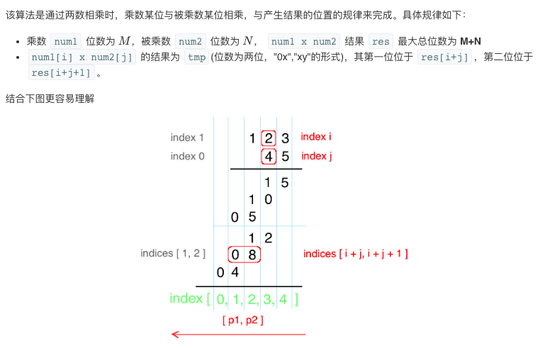

## 题目
给定两个以字符串形式表示的非负整数 num1 和 num2，返回 num1 和 num2 的乘积，它们的乘积也表示为字符串形式。

**示例 1**
```
输入：num1 = "2", num2 = "3"
输出："6"
```

**示例 2**
```
输入：num1 = "123", num2 = "456"
输出："56088"
```

**说明**
* num1 和 num2 的长度小于 110。
* num1 和 num2 只包含数字 0-9。
* num1 和 num2 均不以零开头，除非是数字 0 本身。
* 不能使用任何标准库的大数类型（比如 BigInteger）或直接将输入转换为整数来处理。

## 代码
```Java
class Solution {
    public String multiply(String num1, String num2) {
        if(num1.equals("0") || num2.equals("0")) return "0";
        int m = num1.length();
        int n = num2.length();
        int len1 = m - 1;
        int len2 = n - 1;
        int[] result = new int[m + n];
        for(int i = num1.length() - 1;i >= 0;i--) {
            int n1 = num1.charAt(i) - '0';
            for(int j = num2.length() - 1;j >= 0;j--) {
                int n2 = num2.charAt(j) - '0';
                result[i + j + 1] += n1 * n2;
            }
        }
        for(int i = m + n - 1;i >= 1;i--) {
            result[i - 1] += result[i] / 10;
            result[i] %= 10;
        }
        StringBuilder ans = new StringBuilder();
        int index = result[0] == 0 ? 1 : 0;
        while(index < m + n) {
            ans.append(result[index++]);
        }
        return ans.toString();
    }
}
```

## 思路

很经典的大数乘法，建议背一下。利用了竖式计算的方法


