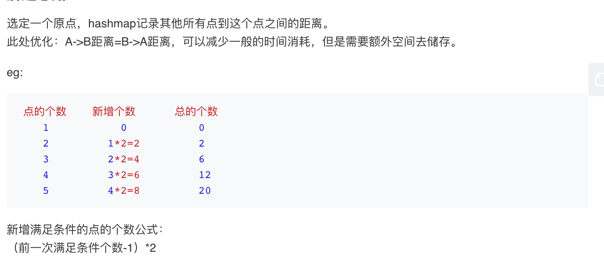

## 题目
给定平面上 n 对不同的点，“回旋镖” 是由点表示的元组 (i, j, k) ，其中 i 和 j 之间的距离和 i 和 k 之间的距离相等（需要考虑元组的顺序）。

找到所有回旋镖的数量。你可以假设 n 最大为 500，所有点的坐标在闭区间 [-10000, 10000] 中。

**示例1**
```
输入:
[[0,0],[1,0],[2,0]]

输出:
2

解释:
两个回旋镖为 [[1,0],[0,0],[2,0]] 和 [[1,0],[2,0],[0,0]]
```

## 代码(hash优化)
```C++
class Solution {
public:
    int numberOfBoomerangs(vector<vector<int>>& points) {
       int res = 0;
        for (int i = 0; i < points.size(); i++) {
            unordered_map<int, int> cache;
            for (int j = 0; j < points.size(); j++) {
                if (j != i)
                    cache[pow(points[j][0] - points[i][0], 2) + pow(points[j][1] - points[i][1], 2)]++;
            }
            for (auto& p : cache)
                res += p.second * (p.second - 1);
        }
        return res;
    }
};
```

## 代码(记录+排序)
```C++
class Solution {
public:
    int numberOfBoomerangs(vector<vector<int>>& points) {
        int dp[points.size()][points.size()];
        int num = 0;
        for (int i = 0; i < points.size(); ++i) {
            for (int j = i; j < points.size(); ++j) {
                dp[i][j] = pow(points[i][0] - points[j][0], 2) + pow(points[i][1] - points[j][1], 2);
                dp[j][i] = dp[i][j];
            }
        }
        for (int i = 0; i < points.size(); ++i) {
            int n = 0;
            sort(dp[i], dp[i] + points.size());
            for (int j = 0; j < points.size() - 1; ++j) {
                if (dp[i][j] == dp[i][j+1]) {
                    ++n;
                } else {
                    num  += n*(n+1);
                    n = 0;
                }
            }
            if (n) {
                num  += n*(n+1);
            }
        }
        return num;
    }
};
```

## 思路

### 解法1
可以利用哈希和排列组合很自然的做出来。


* 时间复杂度：时间复杂度：O(n<sup>2</sup>)。两重循环。
* 空间复杂度：O(n)。哈希表大小最大需要存放n个点的距离。

### 解法2
在提交记录里面抄的最快解法。但是感觉有点奇怪。

* 空间复杂度为O(n<sup>2</sup>)。
* 时间复杂度应该是O(n<sup>2</sup>lgn)。因为在一个for循环里面去排序，但是仍然速度是最快的。难道是因为没用vector吗...不懂。