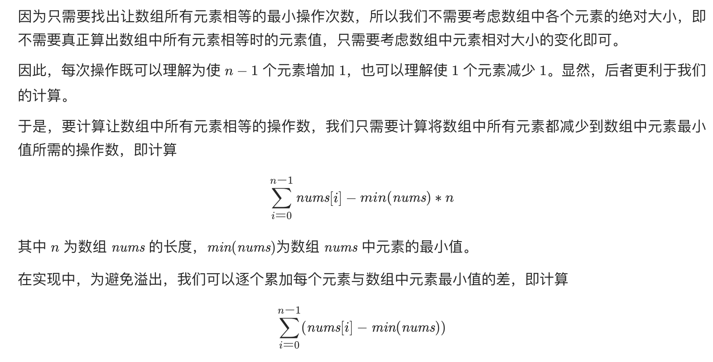

## 题目
给你一个长度为 n 的整数数组，每次操作将会使 n - 1 个元素增加 1 。返回让数组所有元素相等的最小操作次数。

**示例 1**
```
输入：nums = [1,2,3]
输出：3
解释：
只需要 3 次操作（注意每次操作会增加两个元素的值）：
[1,2,3]  =>  [2,3,3]  =>  [3,4,3]  =>  [4,4,4]
```

**示例 2**
```
输入：nums = [1,1,1]
输出：0
```

**提示**

* n == nums.length
* 1 <= nums.length <= 10^5
* -10^9 <= nums[i] <= 10^9

## 代码
```Java
class Solution {
    public int minMoves(int[] nums) {
        int minNum = Arrays.stream(nums).min().getAsInt();
        int res = 0;
        for (int num : nums) {
            res += num - minNum;
        }
        return res;
    }
}
```
## 思路

重点在于如下推导：


* 时间复杂度：O(n)，其中 n 为数组中的元素数量。我们需要一次遍历求出最小值，一次遍历计算操作次数。
* 空间复杂度：O(1)。