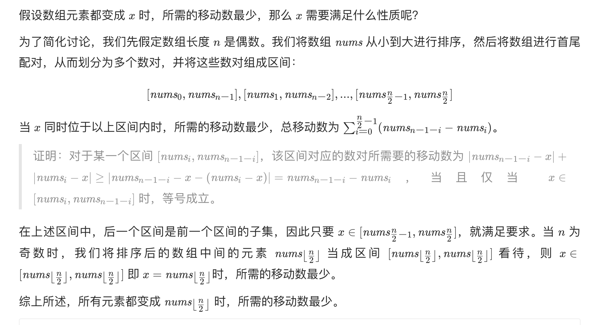

## 题目
给你一个长度为 n 的整数数组 nums ，返回使所有数组元素相等需要的最少移动数。

在一步操作中，你可以使数组中的一个元素加 1 或者减 1 。

**示例 1**
```
输入：nums = [1,2,3]
输出：2
解释：
只需要两步操作（每步操作指南使一个元素加 1 或减 1）：
[1,2,3]  =>  [2,2,3]  =>  [2,2,2]
```

**示例 2**
```
输入：nums = [1,10,2,9]
输出：16
```

**提示**

* n == nums.length
* 1 <= nums.length <= 10^5
* -10^9 <= nums[i] <= 10^9

## 代码
```Java
class Solution {
    public int minMoves2(int[] nums) {
        Arrays.sort(nums);
        int target = nums[nums.length / 2];
        int result = 0;
        for(int i = 0;i < nums.length;i++) {
            result += Math.abs(nums[i] - target);
        }
        return result;
    }
}
```
## 思路

重点在于如下推导：


* 时间复杂度：O(nlogn)，其中 n 是数组 nums 的长度。排序需要 O(nlogn) 的时间。可以通过快排 TopK 求中位数的方式进一步将时间复杂度降低到 O(N)。
* 空间复杂度：O(logn)。排序需要 O(logn) 的递归栈空间。