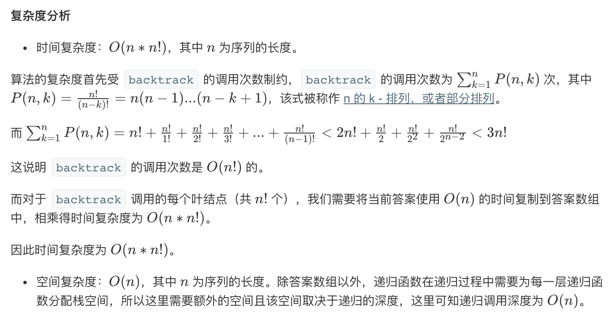

## 题目
给定一个 没有重复 数字的序列，返回其所有可能的全排列。

**示例1**
```
输入: [1,2,3]
输出:
[
  [1,2,3],
  [1,3,2],
  [2,1,3],
  [2,3,1],
  [3,1,2],
  [3,2,1]
]
```

## 代码
```C++
class Solution {
public:
    void dfs(vector<vector<int>>& res, vector<int> &nums, int first, int len){
        if(first == len){
            res.push_back(nums);
            return;
        }
        for(int i = first;i < len;i++){
            swap(nums[i],nums[first]);
            dfs(res,nums,first+1,len);
            swap(nums[i],nums[first]);
        }
    }
    vector<vector<int>> permute(vector<int>& nums) {
        vector<vector<int>> res;
        dfs(res,nums,0,nums.size());
        return res;
    }
};
```

## 思路



