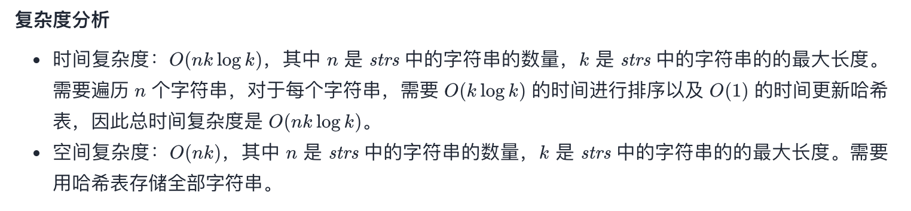
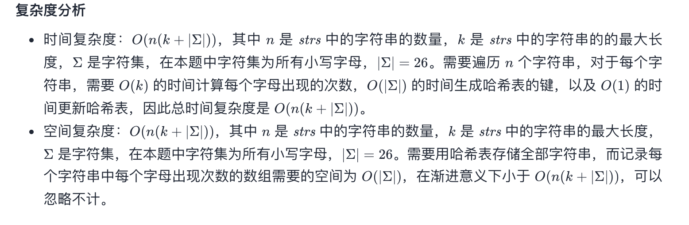

## 题目
给定一个字符串数组，将字母异位词组合在一起。字母异位词指字母相同，但排列不同的字符串。

**示例 1**
```
输入：["eat", "tea", "tan", "ate", "nat", "bat"],
输出：
[
  ["ate","eat","tea"],
  ["nat","tan"],
  ["bat"]
]
```

**说明**
* 所有输入均为小写字母。
* 不考虑答案输出的顺序。

## 代码（排序）
```Java
class Solution {
    public List<List<String>> groupAnagrams(String[] strs) {
        return new ArrayList<>(Stream.of(strs).collect(Collectors.groupingBy(x -> {
                char[] array = x.toCharArray();
                Arrays.sort(array);
                return new String(array);
            })).values());
    }
}
```

## 代码（计数）
```Java
class Solution {
  public List<List<String>> groupAnagrams(String[] strs) {
    return new ArrayList<>(Stream.of(strs).collect(Collectors.groupingBy(x -> {
      int[] array = new int[26];
      for (int i = 0; i < x.length(); i++) {
        array[x.charAt(i) - 'a']++;
      }
      return new CountKey(array);
    })).values());
  }
}

class CountKey {
    int[] count;

    public CountKey(int[] count) {
      this.count = count;
    }

    @Override
    public boolean equals(Object o) {
      if (this == o) {
        return true;
      }
      if (o == null || getClass() != o.getClass()) {
        return false;
      }
      CountKey countKey = (CountKey) o;
      return Arrays.equals(count, countKey.count);
    }

    @Override
    public int hashCode() {
      return Arrays.hashCode(count);
    }
  }
```

## 思路

具体可以参考官方 [博客](https://leetcode-cn.com/problems/group-anagrams/solution/zi-mu-yi-wei-ci-fen-zu-by-leetcode-solut-gyoc/)。此题用了 java 的函数式编程，性能可能不是最快，但可读性应该很不错。

### 解法 1
将每个 str 进行排序，根据排序后的值做一个聚合即可。


### 解法 2
统计每个 str 的字母表，然后做一个聚合即可。
