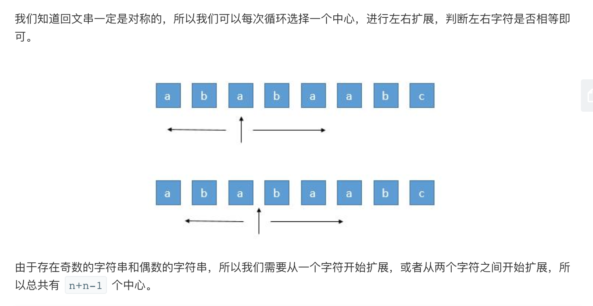

## 题目
给定一个字符串 s，找到 s 中最长的回文子串。你可以假设 s 的最大长度为 1000。

**示例1**
```
输入: "babad"
输出: "bab"
注意: "aba" 也是一个有效答案。
```

**示例2**
```
输入: "cbbd"
输出: "bb"
```

## 代码(中心扩展算法)
```C++
class Solution {
public:
    string longestPalindrome(string s) {
        int size = s.size();
        if(size < 1) return "";
        int start = 0;
        int end = 0;
        for(int i = 0;i < size;i++){
            int len1 = expandAroundCenter(s,i,i);
            int len2 = expandAroundCenter(s,i,i + 1);
            int len = max(len1, len2);
            if(len > end - start){
                start = i - (len - 1) / 2;
                end = i + len / 2;
            }
        }
        return s.substr(start, end - start + 1);
    }

    int expandAroundCenter(string& s,int left, int right){
        while(left >= 0 && right < s.size() && s[left] == s[right]){
            left--;
            right++;
        }
        return right - left - 1;
    }
};
```
## 思路

这题挺有趣的，建议把多种做法都看看学学。这里只列出了容易想到的最优解法：中心扩展解法。还有一个时间复杂度为O(N)的 Manacher 算法，但是不了解的话很难在面试中写出来，就不说了。



* 时间复杂度：O(n^2)，由于围绕中心来扩展回文会耗去 O(n) 的时间，所以总的复杂度为 O(n^2)。
* 空间复杂度：O(1)。

更多可参考此[博客](https://leetcode-cn.com/problems/longest-palindromic-substring/solution/xiang-xi-tong-su-de-si-lu-fen-xi-duo-jie-fa-bao-gu/)