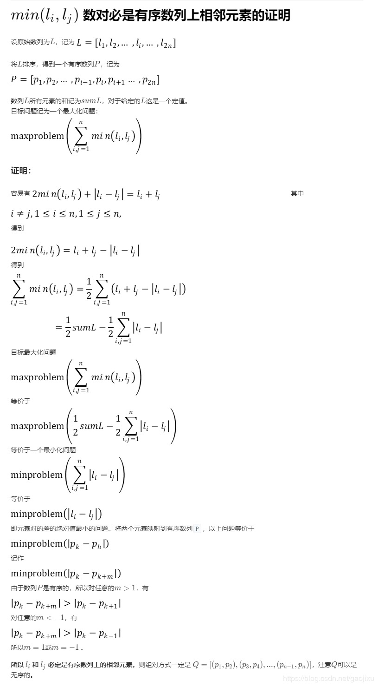

## 题目
给定长度为 2n 的数组, 你的任务是将这些数分成 n 对, 例如 (a1, b1), (a2, b2), ..., (an, bn) ，使得从1 到 n 的 min(ai, bi) 总和最大。

**示例1**
```
输入: [1,4,3,2]

输出: 4
解释: n 等于 2, 最大总和为 4 = min(1, 2) + min(3, 4).
```

**说明**

* n 是正整数,范围在 [1, 10000].
* 数组中的元素范围在 [-10000, 10000].

## 代码
```C++
class Solution {
public:
    int arrayPairSum(vector<int>& nums) {
        int len = nums.size();
        if(len < 2){
            return 0;
        }
        sort(nums.begin(),nums.end());
        int result = 0;
        for(int i = 0;i < len;i += 2){
            result += nums[i];                
        }
        return result;
    }
};
```
## 思路

这题可以通过形式化的数学证明来得到其实对于本题只需对数组排序然后取所有第奇数位的和即可。若是求从 1 到 n 的 min(ai, bi) 总和最小，则是对数组排序取前一半数的和即可。但是不形式化证明也可以利用贪心思想基本猜出来。

证明如下：

