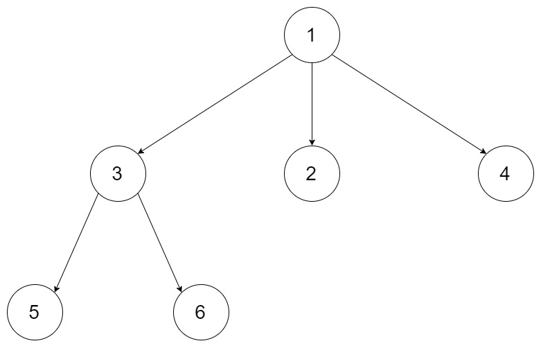

## 题目
给定一个 N 叉树，返回其节点值的前序遍历。

例如，给定一个 3叉树 :


返回其前序遍历: [1,3,5,6,2,4]。

**说明**
* 递归法很简单，你可以使用迭代法完成此题吗?

## 代码(递归)
```C++
/*
// Definition for a Node.
class Node {
public:
    int val;
    vector<Node*> children;

    Node() {}

    Node(int _val) {
        val = _val;
    }

    Node(int _val, vector<Node*> _children) {
        val = _val;
        children = _children;
    }
};
*/
class Solution {
public:
    vector<int> ans;
    
    void _preorder(Node* root){
        if(!root){
            return;
        }
        ans.push_back(root->val);
        for(int i = 0;i < root->children.size();i++){
            _preorder(root->children[i]);
        }
    }

    vector<int> preorder(Node* root) {
        _preorder(root);
        return ans;
    }
};
```

## 代码(迭代)
```C++
/*
// Definition for a Node.
class Node {
public:
    int val;
    vector<Node*> children;

    Node() {}

    Node(int _val) {
        val = _val;
    }

    Node(int _val, vector<Node*> _children) {
        val = _val;
        children = _children;
    }
};
*/
class Solution {
public:
    vector<int> preorder(Node* root) {
        vector<int> ans;
        if(!root) return ans;
        stack<Node*> s;
        s.push(root);
        while(!s.empty()){
            Node* node = s.top();
            s.pop();
            ans.push_back(node->val);
            int size = node->children.size();
            for(int i = 0;i < size;i++){
                s.push(node->children[size-1-i]);
            }
        }
        return ans;
    }
};
```

## 思路

### 解法1

递归做法十分简单，没啥可说的。

* 时间复杂度：O(M)，其中 M 是 N 叉树中的节点个数。每个节点只会遍历一次。
* 空间复杂度：O(M)。在最坏的情况下，这棵 N 叉树只有 N 层，所以系统栈的大小是M。

### 解法2

迭代做法比较巧，需要用到栈而不是队列，因为用栈的话能够保证到了当前节点先解决子节点的遍历而不是解决兄弟节点的遍历。同时需要注意向把children列表反着push进去，这保证了左边节点先pop出来从而能够对子节点从左到右遍历。

* 时间复杂度：O(M)，其中 M 是 N 叉树中的节点个数。每个节点只会入栈和出栈各一次。
* 空间复杂度：O(M)。在最坏的情况下，这棵 N 叉树只有 2 层，所有第 2 层的节点都是根节点的孩子。将根节点推出栈后，需要将这些节点都放入栈，共有 M - 1 个节点，因此栈的大小为 O(M)。