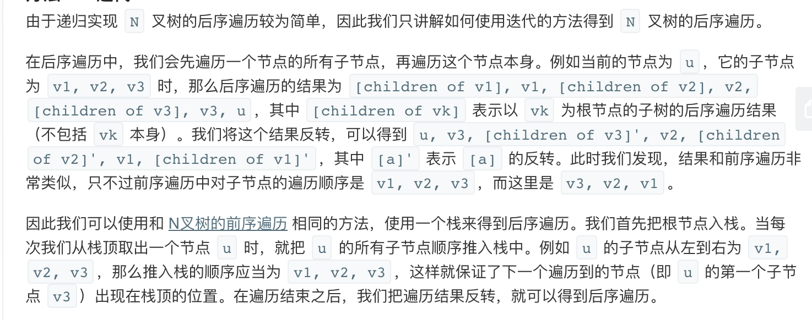

## 题目
给定一个 N 叉树，返回其节点值的后序遍历。

例如，给定一个 3叉树 :


返回其后序遍历: [5,6,3,2,4,1].

**说明**
* 递归法很简单，你可以使用迭代法完成此题吗?

## 代码(递归)
```C++
/*
// Definition for a Node.
class Node {
public:
    int val;
    vector<Node*> children;

    Node() {}

    Node(int _val) {
        val = _val;
    }

    Node(int _val, vector<Node*> _children) {
        val = _val;
        children = _children;
    }
};
*/
class Solution {
public:
    vector<int> ans;
    
    void _postorder(Node* root){
        if(!root) return;
        for(int i = 0;i < root->children.size();i++){
            _postorder(root->children[i]);
        }
        ans.push_back(root->val);
    }
    vector<int> postorder(Node* root) {
        _postorder(root);
        return ans;
    }
};
```

## 代码(迭代)
```C++
/*
// Definition for a Node.
class Node {
public:
    int val;
    vector<Node*> children;

    Node() {}

    Node(int _val) {
        val = _val;
    }

    Node(int _val, vector<Node*> _children) {
        val = _val;
        children = _children;
    }
};
*/
class Solution {
public:
    vector<int> postorder(Node* root) {
        vector<int> ans;
        if(!root) return ans;
        stack<Node*> s;
        s.push(root);
        while(!s.empty()){
            Node* node = s.top();
            s.pop();
            ans.push_back(node->val);
            int size = node->children.size();
            for(int i = 0;i < size;i++){
                s.push(node->children[i]);
            }
        }
        reverse(ans.begin(),ans.end());
        return ans;
    }
};
```

## 思路

### 解法1

递归做法十分简单，没啥可说的。

* 时间复杂度：O(M)，其中 M 是 N 叉树中的节点个数。每个节点只会遍历一次。
* 空间复杂度：O(M)。在最坏的情况下，这棵 N 叉树只有 N 层，所以系统栈的大小是M。

### 解法2



* 时间复杂度：O(M)，其中 M 是 N 叉树中的节点个数。每个节点只会入栈和出栈各一次。
* 空间复杂度：O(M)。在最坏的情况下，这棵 N 叉树只有 2 层，所有第 2 层的节点都是根节点的孩子。将根节点推出栈后，需要将这些节点都放入栈，共有 M - 1 个节点，因此栈的大小为 O(M)。