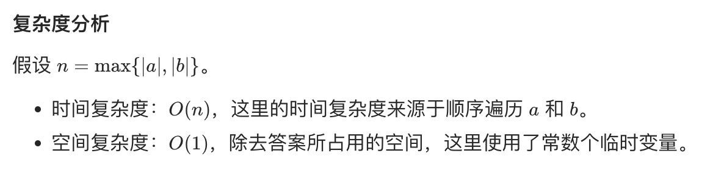

## 题目
给定两个二进制字符串，返回他们的和（用二进制表示）。

输入为非空字符串且只包含数字 1 和 0。

**示例 1**
```
输入：a = "11", b = "1"
输出："100"
```

**示例 2**
```
输入：a = "1010", b = "1011"
输出："10101"
```

**提示**
* 每个字符串仅由字符 '0' 或 '1' 组成。
* 1 <= a.length, b.length <= 10^4
* 字符串如果不是 "0" ，就都不含前导零。

## 代码
```Java
class Solution {
    public String addBinary(String a, String b) {
        int len1 = a.length();
        int len2 = b.length();
        int len = Math.max(len1, len2);
        StringBuilder result = new StringBuilder(len + 1);
        int carry = 0;
        for(int i = 0;i < len;i++){
            carry += i < len1 ? a.charAt(len1 - 1 - i) - '0' : 0;
            carry += i < len2 ? b.charAt(len2 - 1 - i) - '0' : 0;
            result.append((char)((carry & 1) + '0'));
            carry >>= 1; 
        }
        if(carry > 0){
            result.append('1');
        }
        result.reverse();
        return result.toString();
    }
}
```
## 思路


